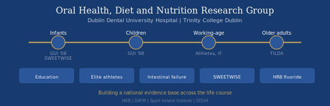

We are a research group based at Dublin Dental University Hospital (DDUH) and Trinity College Dublin (TCD), building a national evidence base on the relationship between diet, nutrition, and oral health across the life course.

Diet is a modifiable risk factor that has been neglected in dental education and clinical practice. Our programme spans five interconnected research strands, from infant nutrition through to oral health in older adults, and from dental education to national policy.

---

## Research Strands

### 1. Education and Diet Assessment Methodology

We developed and implemented a new nutrition curriculum at DDUH, training 180+ dental students per year (Years 2 to 5) in dietary assessment using digital tools. The programme progresses from peer diet workshops, through clinical 24-hour dietary recall using Nutritics software, to OSCE-assessed case portfolios and diet risk assessment.

This work contributed to an international competency framework for diet and nutrition in oral health education (Marshall, Crowe & Touger-Decker, *J Dent Educ* 2025), and we have delivered workshops on digital dietary assessment at IADR Barcelona 2025 and IADR San Diego 2026. We also hosted an ADEE workshop on sustainable diets and oral health at TCD in 2025.

Our global survey of nutrition education in dental schools (COP) has been recently published in the *European Journal of Dental Education*.

**Key publications:**
- Crowe M, O'Sullivan M, Winning L, Cassetti O, et al. Implementation of a food science and nutrition module in a dental undergraduate curriculum. *Eur J Dent Educ* 2023; 27(2): 402-408.
- Marshall TA, Crowe M, Touger-Decker R. A Framework to Establish Diet and Nutrition Competencies for Oral Health Care Education. *J Dent Educ* 2025.
- Crowe, M. et al. Global Survey of Nutrition Education in Dental Schools: Current Practices and Opportunities. *European Journal of Dental Education*, 2026. https://doi.org/10.1111/eje.70230

---

### 2. Oral Health in Irish Elite Athletes

In collaboration with the Sport Ireland Institute (SII), we collected the first national data on diet and oral health in Irish elite athletes. Despite high nutritional awareness, athletes showed a high caries burden, with snack foods and sugar-sweetened beverages identified as major contributors. 90% of elite Irish athletes surveyed had tooth decay.

Ongoing work includes pre-event oral health screening before major international competitions and development of an oral health guide for sports staff with SII.

**Key publications:**
- Hughes A, et al. Digital data collection protocols and template design for an oral health survey. *Discover Public Health* 2024.
- Hughes A, et al. Diet and Dental Caries in Elite Athletes in Ireland. *J Hum Nutr Diet* 2026.

---

### 3. Oral Health and Infection Risk in Intestinal Failure

A cross-sectional study at the St James's Hospital national intestinal failure referral centre (n=29) found untreated dental caries in 72% of patients, salivary dysfunction in one third, and unexpectedly high oral MRSA colonisation (17%). These findings raise the question of whether the oral cavity represents an unrecognised reservoir for catheter-related bloodstream infections in this vulnerable population.

**Status:** Findings submitted to IADH 2026; two papers in preparation.

---

### 4. SWEETWISE: Reducing Sugar in Infant Foods

SWEETWISE is a DAFM-funded consortium (over 1.3 million euro) across TCD, UCD, and TU Dublin, launched in April 2026. The programme addresses the high free sugar content of commercially available complementary foods for infants in Ireland.

TCD/DDUH's role is developing a novel in vitro cariogenicity model to test whether reformulated infant foods reduce cariogenic potential. This links to Growing Up in Ireland (GUI) early childhood caries data and Healthy Ireland sugar reduction targets.

---

### 5. HRB Fluoride Programme: Oral Health and Cognition

Funded by the Health Research Board, this is our largest research strand, examining community water fluoridation (CWF), oral health, and cognitive outcomes using data from The Irish Longitudinal Study on Ageing (TILDA) and Growing Up in Ireland (GUI).

**Building the evidence base:**
- Systematic review of dental caries in Irish children (Sharma et al., *CDOE* 2024)
- Data harmonisation across GUI and international birth cohorts (Sharma et al., *JPHD* 2024)
- Socioeconomic gradient in adolescent oral health (Sharma et al., *CDOE* 2025)
- 52-year CWF review: first comprehensive longitudinal analysis of Irish fluoridation monitoring records (Sharma et al., *CDOE* 2026)
- Tooth loss predicts 12-year mortality in 8,494 older adults (Winning et al., *JAGS* 2025)

**Fluoride and cognition:**
Using individual-level geocoded lifetime fluoride exposure linked via residential histories to water supply records in the TILDA cohort, we found no association between CWF exposure and cognitive function in older Irish adults (IRR = 1.00, fully adjusted). Paper under review.

---

### 6: Oral Health Trajectories in Childhood and Adolescence

Using longitudinal data from the Growing Up in Ireland (GUI) study, this strand examines how oral health behaviours and outcomes develop from early childhood through adolescence in Ireland. Applying life-course epidemiological methods across GUI Cohorts '98, '08 and '24, the research identifies critical periods for prevention and the sociodemographic and dietary drivers of oral health inequality. Subject to feasibility and ethical approval, a nested cohort component will link clinical assessment to existing GUI self-report data.
Team: Professor Michael O'Sullivan (PI), Dr Michael Crowe, Professor Lewis Winning, Dr Vinay Sharma (DDUH/TCD). PhD candidate Sept 2026
Funding: Trinity Research Doctorate Award 2026, School of Dental Science, Trinity College Dublin.

---
**Resources:**

- [GUI Oral Health Dashboard](https://dduh.shinyapps.io/dduh/) (interactive cohort analysis tool)
- [ODK Templates](https://oral-health-nutrition.github.io/odk/) (basic data collection templates)
- [HRB Fluoride Programme](https://oral-health-nutrition.github.io/fluoride/#team-)

---

## Team

**Core Research Team**

| Name | Role | Affiliation |
|------|------|-------------|
| Michael Crowe | DDUH / TCD |
| Michael O'Sullivan | DDUH / TCD |
| Lewis Winning | DDUH / TCD |
| Brian O'Connell| DDUH / TCD 
| Gary Moran | DDUH / TCD
| Lina Zgaga | TCD
| Vinay Sharma | Postdoctoral Fellow | TCD |
| Oscar Cassetti | Research Fellow | TCD |
| Aifric O'Sullivan | UCD |
| Jaime Knox Macleod (TCD, PhD candidate)
| David McMahon | (TCD, DChDent candidate)
| Aoife Caitriona Broderick | (TCD, DChDent candidate)

**Collaborators**

Annie Hughes, Emma Feeney (UCD), Jan Rigby (Maynooth University, NCG), Michael Cronin (UCC), Rose Anne Kenny (TILDA/TCD), Eithne O'Flaherty (TCD), Brendan Egan (DCU/SII), Sharon Madigan (SII), Michaela Goodwin (University of Manchester), Teresa Marshall (University of Iowa), Rena Touger-Decker (Rutgers University), Katie O'Farrell (CSO)

---

## Funding

- Health Research Board (HRB)
- Department of Agriculture, Food and the Marine (DAFM)
- Dublin Dental University Hospital

---

## Publications

### 2026
- Hughes A, et al. Diet and Dental Caries in Elite Athletes in Ireland. *J Hum Nutr Diet* 2026.
- Sharma V, et al. Longitudinal Analysis of Fluoride Levels in Irish Water Supplies: A 52-Year Review. *Community Dent Oral Epidemiol* 2026.
- Sharma V, et al. Socio-Economic Differences in the Oral Health of Irish Adolescents. *Community Dent Oral Epidemiol* 2025/2026.
- Crowe, M. et al. Global Survey of Nutrition Education in Dental Schools: Current Practices and Opportunities. European Journal of Dental Education, 2026. https://doi.org/10.1111/eje.70230

### 2025
- Marshall TA, Crowe M, Touger-Decker R. A Framework to Establish Diet and Nutrition Competencies for Oral Health Care Education. *J Dent Educ* 2025.
- Winning L, et al. Tooth Loss and 12-Year Mortality Risk in 8,494 Older Adults From Ireland. *J Am Geriatr Soc* 2025.

### 2024
- Hughes A, et al. Digital data collection protocols and template design for an oral health survey. *Discover Public Health* 2024.
- Sharma V, et al. Evaluating the harmonization potential of oral health-related questionnaires. *J Public Health Dent* 2024.
- Sharma V, et al. Dental caries in children in Ireland: A systematic review. *Community Dent Oral Epidemiol* 2024.
- Winning L, et al. Vitamin D, periodontitis and tooth loss in older Irish adults. 2024.

### 2023
- Crowe M, et al. Implementation of a food science and nutrition module in a dental undergraduate curriculum. *Eur J Dent Educ* 2023; 27(2): 402-408.
- Sharma V, et al. Protocol for developing a dashboard for interactive cohort analysis. *BMC Oral Health* 2023.
- Sharma V, et al. Estimation and consumption pattern of free sugar intake in 3-year-olds. 2023.

### Earlier
- Crowe M, et al. Data Mapping From Food Diaries to Augment the Amount and Frequency of Foods Measured Using Short Food Questionnaires. *Front Nutr* 2018.
- Crowe M, et al. Early Childhood Dental Problems Classification Tree Analyses. 2021.
- Crowe M, et al. Weight Status and Dental Problems in Early Childhood. 2021.
- Crowe M. Sugar tax and obesity. 2021.

### Under Review / In Preparation
- Sharma V et al. CWF and cognitive outcomes in older Irish adults. *(under review)*
- Intestinal failure and oral health (2 papers in preparation)

---

## Resources

- [GUI Oral Health Dashboard](https://dduh.shinyapps.io/dduh/) - interactive exploratory data analysis of aggregated surveys (Infant GUI, Child GUI, NCFS 2)
- [ODK Templates](https://oral-health-nutrition.github.io/odk/) - basic data collection templates
- https://oral-health-nutrition.github.io/fluoride/#team- - HRB funded project 

---

## Contact

Dr Michael Crowe
Associate Professor, Food Science, Nutrition and Oral Health
Dublin Dental University Hospital, Trinity College Dublin

michael.crowe@dental.tcd.ie

Or

Michael O'Sullivan
Professor/ Consultant in Restorative Dentistry (Special Needs)
Dublin Dental University Hospital, Trinity College Dublin

michael.o'sullivan@dental.tcd.ie

Clinical Director
