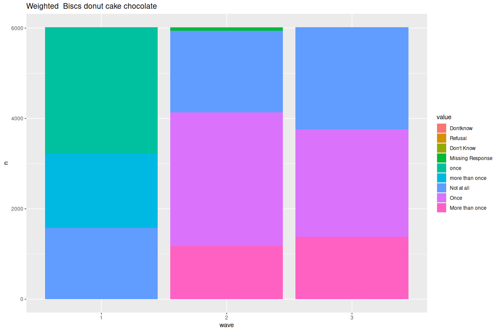
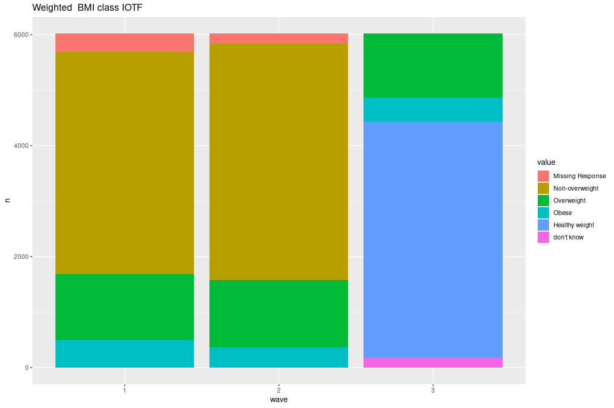
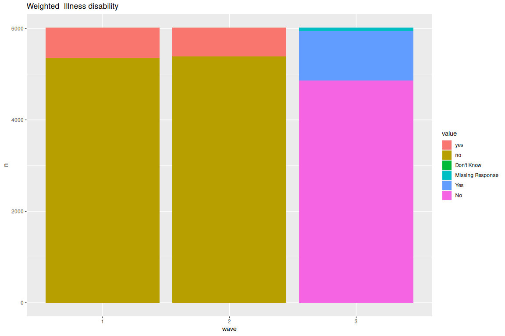

```r
knitr::opts_chunk$set(echo = FALSE, warning = FALSE, tidy = TRUE)

conf <- load_config("../../configs/gui_data.yaml")
```
# Data conversion 

We convert the data from SPPS to R using our `convertGUI` package.


```r
xguiDF9 <- convertGUI(conf$data_repositories$gui_9_yo, "9-yo-cols.csv", version = 2)
xguiDF13 <- convertGUI(conf$data_repositories$gui_13_yo, "13-yo-cols.csv", version = 2)
xguiDF17 <- convertGUI(conf$data_repositories$gui_17_yo, "17-yo-cols.csv", version = 2)
```

In wave 1 BMI was not computed directly, computation done here:

## IOTF and BMI calculation for 9 years old (wave 1)


# Survey Overiew

<table>
<caption>Total count by wave</caption>
 <thead>
  <tr>
   <th style="text-align:left;"> wave </th>
   <th style="text-align:right;"> total </th>
  </tr>
 </thead>
<tbody>
  <tr>
   <td style="text-align:left;"> wave_1 </td>
   <td style="text-align:right;"> 8568 </td>
  </tr>
  <tr>
   <td style="text-align:left;"> wave_2 </td>
   <td style="text-align:right;"> 7525 </td>
  </tr>
  <tr>
   <td style="text-align:left;"> wave_3 </td>
   <td style="text-align:right;"> 6216 </td>
  </tr>
</tbody>
</table>

<table>
<caption>Split by gender</caption>
 <thead>
  <tr>
   <th style="text-align:left;"> Gender_yp </th>
   <th style="text-align:right;"> n </th>
   <th style="text-align:right;"> prop </th>
   <th style="text-align:left;"> wave </th>
  </tr>
 </thead>
<tbody>
  <tr>
   <td style="text-align:left;"> male </td>
   <td style="text-align:right;"> 4164 </td>
   <td style="text-align:right;"> 0.49 </td>
   <td style="text-align:left;"> wave_1 </td>
  </tr>
  <tr>
   <td style="text-align:left;"> female </td>
   <td style="text-align:right;"> 4404 </td>
   <td style="text-align:right;"> 0.51 </td>
   <td style="text-align:left;"> wave_1 </td>
  </tr>
  <tr>
   <td style="text-align:left;"> male </td>
   <td style="text-align:right;"> 3682 </td>
   <td style="text-align:right;"> 0.49 </td>
   <td style="text-align:left;"> wave_2 </td>
  </tr>
  <tr>
   <td style="text-align:left;"> female </td>
   <td style="text-align:right;"> 3843 </td>
   <td style="text-align:right;"> 0.51 </td>
   <td style="text-align:left;"> wave_2 </td>
  </tr>
  <tr>
   <td style="text-align:left;"> male </td>
   <td style="text-align:right;"> 3033 </td>
   <td style="text-align:right;"> 0.49 </td>
   <td style="text-align:left;"> wave_3 </td>
  </tr>
  <tr>
   <td style="text-align:left;"> female </td>
   <td style="text-align:right;"> 3183 </td>
   <td style="text-align:right;"> 0.51 </td>
   <td style="text-align:left;"> wave_3 </td>
  </tr>
</tbody>
</table>

```
## `summarise()` has grouped output by 'Gender_yp'. You can override using the
## `.groups` argument.
```

<table>
 <thead>
  <tr>
   <th style="text-align:left;"> wave </th>
   <th style="text-align:right;"> total </th>
   <th style="text-align:right;"> diff </th>
   <th style="text-align:right;"> prop_diff </th>
  </tr>
 </thead>
<tbody>
  <tr>
   <td style="text-align:left;"> wave_1 </td>
   <td style="text-align:right;"> 8568 </td>
   <td style="text-align:right;"> NA </td>
   <td style="text-align:right;"> NA </td>
  </tr>
  <tr>
   <td style="text-align:left;"> wave_2 </td>
   <td style="text-align:right;"> 7525 </td>
   <td style="text-align:right;"> 1043 </td>
   <td style="text-align:right;"> 0.1217320 </td>
  </tr>
  <tr>
   <td style="text-align:left;"> wave_3 </td>
   <td style="text-align:right;"> 6216 </td>
   <td style="text-align:right;"> 1309 </td>
   <td style="text-align:right;"> 0.1739535 </td>
  </tr>
</tbody>
</table>

<table>
 <thead>
  <tr>
   <th style="text-align:left;"> Gender_yp </th>
   <th style="text-align:right;"> diff </th>
   <th style="text-align:right;"> prop_diff </th>
   <th style="text-align:right;"> prop </th>
  </tr>
 </thead>
<tbody>
  <tr>
   <td style="text-align:left;"> male </td>
   <td style="text-align:right;"> 482 </td>
   <td style="text-align:right;"> 0.1157541 </td>
   <td style="text-align:right;"> 0.2049320 </td>
  </tr>
  <tr>
   <td style="text-align:left;"> male </td>
   <td style="text-align:right;"> 649 </td>
   <td style="text-align:right;"> 0.1762629 </td>
   <td style="text-align:right;"> 0.2759354 </td>
  </tr>
  <tr>
   <td style="text-align:left;"> female </td>
   <td style="text-align:right;"> 561 </td>
   <td style="text-align:right;"> 0.1273842 </td>
   <td style="text-align:right;"> 0.2385204 </td>
  </tr>
  <tr>
   <td style="text-align:left;"> female </td>
   <td style="text-align:right;"> 660 </td>
   <td style="text-align:right;"> 0.1717408 </td>
   <td style="text-align:right;"> 0.2806122 </td>
  </tr>
</tbody>
</table>

# Weighted

<table>
<caption>Total count by wave</caption>
 <thead>
  <tr>
   <th style="text-align:left;"> wave </th>
   <th style="text-align:right;"> total </th>
  </tr>
 </thead>
<tbody>
  <tr>
   <td style="text-align:left;"> wave_1 </td>
   <td style="text-align:right;"> 8567.942 </td>
  </tr>
  <tr>
   <td style="text-align:left;"> wave_2 </td>
   <td style="text-align:right;"> 7524.959 </td>
  </tr>
  <tr>
   <td style="text-align:left;"> wave_3 </td>
   <td style="text-align:right;"> 6215.990 </td>
  </tr>
</tbody>
</table>

<table>
<caption>Split by gender</caption>
 <thead>
  <tr>
   <th style="text-align:left;"> Gender_yp </th>
   <th style="text-align:right;"> n </th>
   <th style="text-align:right;"> prop </th>
   <th style="text-align:left;"> wave </th>
  </tr>
 </thead>
<tbody>
  <tr>
   <td style="text-align:left;"> male </td>
   <td style="text-align:right;"> 4381.189 </td>
   <td style="text-align:right;"> 0.51 </td>
   <td style="text-align:left;"> wave_1 </td>
  </tr>
  <tr>
   <td style="text-align:left;"> female </td>
   <td style="text-align:right;"> 4186.753 </td>
   <td style="text-align:right;"> 0.49 </td>
   <td style="text-align:left;"> wave_1 </td>
  </tr>
  <tr>
   <td style="text-align:left;"> male </td>
   <td style="text-align:right;"> 3833.317 </td>
   <td style="text-align:right;"> 0.51 </td>
   <td style="text-align:left;"> wave_2 </td>
  </tr>
  <tr>
   <td style="text-align:left;"> female </td>
   <td style="text-align:right;"> 3691.641 </td>
   <td style="text-align:right;"> 0.49 </td>
   <td style="text-align:left;"> wave_2 </td>
  </tr>
  <tr>
   <td style="text-align:left;"> male </td>
   <td style="text-align:right;"> 3182.534 </td>
   <td style="text-align:right;"> 0.51 </td>
   <td style="text-align:left;"> wave_3 </td>
  </tr>
  <tr>
   <td style="text-align:left;"> female </td>
   <td style="text-align:right;"> 3033.455 </td>
   <td style="text-align:right;"> 0.49 </td>
   <td style="text-align:left;"> wave_3 </td>
  </tr>
</tbody>
</table>

```
## `summarise()` has grouped output by 'Gender_yp'. You can override using the
## `.groups` argument.
```

<table>
<caption>Drop off </caption>
 <thead>
  <tr>
   <th style="text-align:left;"> wave </th>
   <th style="text-align:right;"> total </th>
   <th style="text-align:right;"> diff </th>
   <th style="text-align:right;"> prop_diff </th>
  </tr>
 </thead>
<tbody>
  <tr>
   <td style="text-align:left;"> wave_1 </td>
   <td style="text-align:right;"> 8567.942 </td>
   <td style="text-align:right;"> NA </td>
   <td style="text-align:right;"> NA </td>
  </tr>
  <tr>
   <td style="text-align:left;"> wave_2 </td>
   <td style="text-align:right;"> 7524.959 </td>
   <td style="text-align:right;"> 1042.983 </td>
   <td style="text-align:right;"> 0.1217309 </td>
  </tr>
  <tr>
   <td style="text-align:left;"> wave_3 </td>
   <td style="text-align:right;"> 6215.990 </td>
   <td style="text-align:right;"> 1308.969 </td>
   <td style="text-align:right;"> 0.1739503 </td>
  </tr>
</tbody>
</table>

<table>
<caption>Drop off by gender</caption>
 <thead>
  <tr>
   <th style="text-align:left;"> Gender_yp </th>
   <th style="text-align:right;"> diff </th>
   <th style="text-align:right;"> prop_diff </th>
   <th style="text-align:right;"> prop </th>
  </tr>
 </thead>
<tbody>
  <tr>
   <td style="text-align:left;"> male </td>
   <td style="text-align:right;"> 547.8713 </td>
   <td style="text-align:right;"> 0.1250508 </td>
   <td style="text-align:right;"> 0.2329432 </td>
  </tr>
  <tr>
   <td style="text-align:left;"> male </td>
   <td style="text-align:right;"> 650.7831 </td>
   <td style="text-align:right;"> 0.1697702 </td>
   <td style="text-align:right;"> 0.2766991 </td>
  </tr>
  <tr>
   <td style="text-align:left;"> female </td>
   <td style="text-align:right;"> 495.1116 </td>
   <td style="text-align:right;"> 0.1182567 </td>
   <td style="text-align:right;"> 0.2105109 </td>
  </tr>
  <tr>
   <td style="text-align:left;"> female </td>
   <td style="text-align:right;"> 658.1860 </td>
   <td style="text-align:right;"> 0.1782909 </td>
   <td style="text-align:right;"> 0.2798467 </td>
  </tr>
</tbody>
</table>


## Descriptive longitudinal


```
## $Categorical
```

<!-- -->

```
## 
## $Continuous
```

<!-- -->

### Summaries

```{=html}
<meta http-equiv="Content-Type" content="text/html; charset=utf-8" /> 
<script type="text/javascript">
<!--
    function expand_collapse(id) {
       var e = document.getElementById(id);
       var f = document.getElementById(id+"_earrows");
       if(e.style.display == 'none'){
          e.style.display = 'block';
          f.innerHTML = '&#9650';
       }
       else {
          e.style.display = 'none';
          f.innerHTML = '&#9660';
       }
    }
//-->
</script>
<style>
.earrows {color:silver;font-size:11px;}

fcap {
 font-family: Verdana;
 font-size: 12px;
 color: MidnightBlue
 }

smg {
 font-family: Verdana;
 font-size: 10px;
 color: &#808080;
}

hr.thinhr { margin-top: 0.15em; margin-bottom: 0.15em; }

span.xscript {
position: relative;
}
span.xscript sub {
position: absolute;
left: 0.1em;
bottom: -1ex;
}
</style>
 <title>. Descriptives</title> <font color="MidnightBlue"><div align=center><span style="font-weight:bold">. <br><br> 49  Variables   6039  Observations</span></div></font> <hr class="thinhr"> <span style="font-weight:bold">Tbrush_freq_9</span>: C8. Study Child brush teeth at least once daily<div style='float: right; text-align: right;'></div> <style>
 .hmisctable419454 {
 border: none;
 font-size: 85%;
 }
 .hmisctable419454 td {
 text-align: center;
 padding: 0 1ex 0 1ex;
 }
 .hmisctable419454 th {
 color: MidnightBlue;
 text-align: center;
 padding: 0 1ex 0 1ex;
 font-weight: normal;
 }
 </style>
 <table class="hmisctable419454">
 <tr><th>n</th><th>missing</th><th>distinct</th></tr>
 <tr><td>6039</td><td>0</td><td>3</td></tr>
 </table>
 <pre style="font-size:85%;">
 Value           yes       no Dontknow
 Frequency      5782      248        9
 Proportion    0.957    0.041    0.001
 </pre>
 <hr class="thinhr"> <span style="font-weight:bold">Tbrush_freq_13</span>: Q34. How often do you brush your teeth?<div style='float: right; text-align: right;'></div> <style>
 .hmisctable101088 {
 border: none;
 font-size: 85%;
 }
 .hmisctable101088 td {
 text-align: center;
 padding: 0 1ex 0 1ex;
 }
 .hmisctable101088 th {
 color: MidnightBlue;
 text-align: center;
 padding: 0 1ex 0 1ex;
 font-weight: normal;
 }
 </style>
 <table class="hmisctable101088">
 <tr><th>n</th><th>missing</th><th>distinct</th></tr>
 <tr><td>6039</td><td>0</td><td>7</td></tr>
 </table>
 <style>
 .hmisctable592138 {
 border: none;
 font-size: 85%;
 }
 .hmisctable592138 td {
 text-align: right;
 padding: 0 1ex 0 1ex;
 }
 .hmisctable592138 th {
 color: Black;
 text-align: center;
 padding: 0 1ex 0 1ex;
 font-weight: bold;
 }
 </style>
 <table class="hmisctable592138">
 <tr><td><font color="MidnightBlue">lowest</font> :</td><td>More than twice a day     </td><td>Twice a day               </td><td>Once a day                </td><td>Less often than once a day</td><td>Rarely / Not at all       </td></tr>
 <tr><td><font color="MidnightBlue">highest</font>:</td><td>Once a day                </td><td>Less often than once a day</td><td>Rarely / Not at all       </td><td>Refusal                   </td><td>Missing Response          </td></tr>
 </table>
  More than twice a day (641, 0.106), Twice a day (3893, 0.645), Once a day (1170, 0.194), Less often than once a day (149, 0.025), Rarely / Not at all (132, 0.022), Refusal (5, 0.001), Missing Response (49, 0.008) <hr class="thinhr"> <span style="font-weight:bold">Tbrush_freq_17</span>: O2. How often do you brush your teeth<div style='float: right; text-align: right;'></div> <style>
 .hmisctable994891 {
 border: none;
 font-size: 85%;
 }
 .hmisctable994891 td {
 text-align: center;
 padding: 0 1ex 0 1ex;
 }
 .hmisctable994891 th {
 color: MidnightBlue;
 text-align: center;
 padding: 0 1ex 0 1ex;
 font-weight: normal;
 }
 </style>
 <table class="hmisctable994891">
 <tr><th>n</th><th>missing</th><th>distinct</th></tr>
 <tr><td>6039</td><td>0</td><td>6</td></tr>
 </table>
 <style>
 .hmisctable898755 {
 border: none;
 font-size: 85%;
 }
 .hmisctable898755 td {
 text-align: right;
 padding: 0 1ex 0 1ex;
 }
 .hmisctable898755 th {
 color: Black;
 text-align: center;
 padding: 0 1ex 0 1ex;
 font-weight: bold;
 }
 </style>
 <table class="hmisctable898755">
 <tr><td><font color="MidnightBlue">lowest</font> :</td><td>More than twice a day     </td><td>Twice a day               </td><td>Once a day                </td><td>Less often than once a day</td><td>Rarely                    </td></tr>
 <tr><td><font color="MidnightBlue">highest</font>:</td><td>Twice a day               </td><td>Once a day                </td><td>Less often than once a day</td><td>Rarely                    </td><td>Don't Know                </td></tr>
 </table>
 <pre style="font-size:85%;">
 Value           More than twice a day                Twice a day
 Frequency                        1375                       3645
 Proportion                      0.228                      0.604
                                                                 
 Value                      Once a day Less often than once a day
 Frequency                         894                         87
 Proportion                      0.148                      0.014
                                                                 
 Value                          Rarely                 Don't Know
 Frequency                          33                          5
 Proportion                      0.005                      0.001
 </pre>
 <hr class="thinhr"> <span style="font-weight:bold">Exos_PCG_report_13</span>: B20. Has child ever had?:  (b) Any permanent/secondary teeth pulled?<div style='float: right; text-align: right;'></div> <style>
 .hmisctable608577 {
 border: none;
 font-size: 85%;
 }
 .hmisctable608577 td {
 text-align: center;
 padding: 0 1ex 0 1ex;
 }
 .hmisctable608577 th {
 color: MidnightBlue;
 text-align: center;
 padding: 0 1ex 0 1ex;
 font-weight: normal;
 }
 </style>
 <table class="hmisctable608577">
 <tr><th>n</th><th>missing</th><th>distinct</th></tr>
 <tr><td>6039</td><td>0</td><td>4</td></tr>
 </table>
 <pre style="font-size:85%;">
 Value                   yes               no       Don't Know Missing Response
 Frequency               998             5029               11                1
 Proportion            0.165            0.833            0.002            0.000
 </pre>
 <hr class="thinhr"> <span style="font-weight:bold">Exos_PCG_report_17</span>: B9. How many permanent teeth YP has had extracted<div style='float: right; text-align: right;'></div> <style>
 .hmisctable366566 {
 border: none;
 font-size: 85%;
 }
 .hmisctable366566 td {
 text-align: center;
 padding: 0 1ex 0 1ex;
 }
 .hmisctable366566 th {
 color: MidnightBlue;
 text-align: center;
 padding: 0 1ex 0 1ex;
 font-weight: normal;
 }
 </style>
 <table class="hmisctable366566">
 <tr><th>n</th><th>missing</th><th>distinct</th></tr>
 <tr><td>6039</td><td>0</td><td>6</td></tr>
 </table>
 <style>
 .hmisctable586289 {
 border: none;
 font-size: 85%;
 }
 .hmisctable586289 td {
 text-align: right;
 padding: 0 1ex 0 1ex;
 }
 .hmisctable586289 th {
 color: Black;
 text-align: center;
 padding: 0 1ex 0 1ex;
 font-weight: bold;
 }
 </style>
 <table class="hmisctable586289">
 <tr><td><font color="MidnightBlue">lowest</font> :</td><td>None            </td><td>One             </td><td>Two             </td><td>Three or more   </td><td>Don't Know      </td></tr>
 <tr><td><font color="MidnightBlue">highest</font>:</td><td>One             </td><td>Two             </td><td>Three or more   </td><td>Don't Know      </td><td>Missing Response</td></tr>
 </table>
 <pre style="font-size:85%;">
 Value                  None              One              Two    Three or more
 Frequency              4680              536              408              337
 Proportion            0.775            0.089            0.068            0.056
                                             
 Value            Don't Know Missing Response
 Frequency                32               46
 Proportion            0.005            0.008
 </pre>
 <hr class="thinhr"> <span style="font-weight:bold">Dent_visit_freq_9</span>: C9. Study Childs frequency of dental visits<div style='float: right; text-align: right;'></div> <style>
 .hmisctable486806 {
 border: none;
 font-size: 85%;
 }
 .hmisctable486806 td {
 text-align: center;
 padding: 0 1ex 0 1ex;
 }
 .hmisctable486806 th {
 color: MidnightBlue;
 text-align: center;
 padding: 0 1ex 0 1ex;
 font-weight: normal;
 }
 </style>
 <table class="hmisctable486806">
 <tr><th>n</th><th>missing</th><th>distinct</th></tr>
 <tr><td>6039</td><td>0</td><td>6</td></tr>
 </table>
 <style>
 .hmisctable406052 {
 border: none;
 font-size: 85%;
 }
 .hmisctable406052 td {
 text-align: right;
 padding: 0 1ex 0 1ex;
 }
 .hmisctable406052 th {
 color: Black;
 text-align: center;
 padding: 0 1ex 0 1ex;
 font-weight: bold;
 }
 </style>
 <table class="hmisctable406052">
 <tr><td><font color="MidnightBlue">lowest</font> :</td><td>At least once a year        </td><td>Once every two years        </td><td>Once every three years      </td><td>Only when there is a problem</td><td>Never/almost never          </td></tr>
 <tr><td><font color="MidnightBlue">highest</font>:</td><td>Once every two years        </td><td>Once every three years      </td><td>Only when there is a problem</td><td>Never/almost never          </td><td>Dontknow                    </td></tr>
 </table>
  At least once a year (3881, 0.643), Once every two years (1246, 0.206), Once every three years (170, 0.028), Only when there is a problem (600, 0.099), Never/almost never (134, 0.022), Dontknow (8, 0.001) <hr class="thinhr"> <span style="font-weight:bold">Dent_visit_freq_13</span>: B19. Which of the following best describes how regularly child visits the dentist?<div style='float: right; text-align: right;'></div> <style>
 .hmisctable301602 {
 border: none;
 font-size: 85%;
 }
 .hmisctable301602 td {
 text-align: center;
 padding: 0 1ex 0 1ex;
 }
 .hmisctable301602 th {
 color: MidnightBlue;
 text-align: center;
 padding: 0 1ex 0 1ex;
 font-weight: normal;
 }
 </style>
 <table class="hmisctable301602">
 <tr><th>n</th><th>missing</th><th>distinct</th></tr>
 <tr><td>6039</td><td>0</td><td>7</td></tr>
 </table>
 <style>
 .hmisctable298323 {
 border: none;
 font-size: 85%;
 }
 .hmisctable298323 td {
 text-align: right;
 padding: 0 1ex 0 1ex;
 }
 .hmisctable298323 th {
 color: Black;
 text-align: center;
 padding: 0 1ex 0 1ex;
 font-weight: bold;
 }
 </style>
 <table class="hmisctable298323">
 <tr><td><font color="MidnightBlue">lowest</font> :</td><td>At least once a year        </td><td>Once every two years        </td><td>Once every three years      </td><td>Only when there is a problem</td><td>Never/almost never          </td></tr>
 <tr><td><font color="MidnightBlue">highest</font>:</td><td>Once every three years      </td><td>Only when there is a problem</td><td>Never/almost never          </td><td>Don't Know                  </td><td>Missing Response            </td></tr>
 </table>
  At least once a year (4157, 0.688), Once every two years (1021, 0.169), Once every three years (139, 0.023), Only when there is a problem (675, 0.112), Never/almost never (45, 0.007), Don't Know (1, 0.000), Missing Response (1, 0.000) <hr class="thinhr"> <span style="font-weight:bold">Dent_visit_freq_17</span>: O3. How often visits the dentist<div style='float: right; text-align: right;'></div> <style>
 .hmisctable150645 {
 border: none;
 font-size: 85%;
 }
 .hmisctable150645 td {
 text-align: center;
 padding: 0 1ex 0 1ex;
 }
 .hmisctable150645 th {
 color: MidnightBlue;
 text-align: center;
 padding: 0 1ex 0 1ex;
 font-weight: normal;
 }
 </style>
 <table class="hmisctable150645">
 <tr><th>n</th><th>missing</th><th>distinct</th></tr>
 <tr><td>6039</td><td>0</td><td>6</td></tr>
 </table>
 <style>
 .hmisctable314107 {
 border: none;
 font-size: 85%;
 }
 .hmisctable314107 td {
 text-align: right;
 padding: 0 1ex 0 1ex;
 }
 .hmisctable314107 th {
 color: Black;
 text-align: center;
 padding: 0 1ex 0 1ex;
 font-weight: bold;
 }
 </style>
 <table class="hmisctable314107">
 <tr><td><font color="MidnightBlue">lowest</font> :</td><td>At least once a year        </td><td>Once every two years        </td><td>Once every three years      </td><td>Only when there is a problem</td><td>Never/almost never          </td></tr>
 <tr><td><font color="MidnightBlue">highest</font>:</td><td>Once every two years        </td><td>Once every three years      </td><td>Only when there is a problem</td><td>Never/almost never          </td><td>Don't Know                  </td></tr>
 </table>
  At least once a year (3257, 0.539), Once every two years (788, 0.130), Once every three years (196, 0.032), Only when there is a problem (1548, 0.256), Never/almost never (244, 0.040), Don't Know (6, 0.001) <hr class="thinhr"> <span style="font-weight:bold">weighting_factor</span>: Weighting Factor - 17yr – Full sample (9yr & 17yr) <span style="font-size: 80%;">Format:F8.2</span><div style='float: right; text-align: right;'></div> <style>
 .hmisctable507764 {
 border: none;
 font-size: 74%;
 }
 .hmisctable507764 td {
 text-align: center;
 padding: 0 1ex 0 1ex;
 }
 .hmisctable507764 th {
 color: MidnightBlue;
 text-align: center;
 padding: 0 1ex 0 1ex;
 font-weight: normal;
 }
 </style>
 <table class="hmisctable507764">
 <tr><th>n</th><th>missing</th><th>distinct</th><th>Info</th><th>Mean</th><th>Gmd</th><th>.05</th><th>.10</th><th>.25</th><th>.50</th><th>.75</th><th>.90</th><th>.95</th></tr>
 <tr><td>6039</td><td>0</td><td>5978</td><td>1</td><td>0.9969</td><td>0.8432</td><td>0.2364</td><td>0.2917</td><td>0.4342</td><td>0.6978</td><td>1.2030</td><td>2.0532</td><td>2.9451</td></tr>
 </table>
 <style>
 .hmisctable838014 {
 border: none;
 font-size: 85%;
 }
 .hmisctable838014 td {
 text-align: right;
 padding: 0 1ex 0 1ex;
 }
 .hmisctable838014 th {
 color: Black;
 text-align: center;
 padding: 0 1ex 0 1ex;
 font-weight: bold;
 }
 </style>
 <table class="hmisctable838014">
 <tr><td><font color="MidnightBlue">lowest</font> :</td><td>0.1271185</td><td>0.1340005</td><td>0.1342876</td><td>0.1354338</td><td>0.1363615</td></tr>
 <tr><td><font color="MidnightBlue">highest</font>:</td><td>4.9023850</td><td>4.9122514</td><td>4.9126212</td><td>4.9287097</td><td>4.9413613</td></tr>
 </table>
 <hr class="thinhr"> <span style="font-weight:bold">Gender_yp</span>: Gender P2 <style>
 .hmisctable715222 {
 border: none;
 font-size: 85%;
 }
 .hmisctable715222 td {
 text-align: center;
 padding: 0 1ex 0 1ex;
 }
 .hmisctable715222 th {
 color: MidnightBlue;
 text-align: center;
 padding: 0 1ex 0 1ex;
 font-weight: normal;
 }
 </style>
 <table class="hmisctable715222">
 <tr><th>n</th><th>missing</th><th>distinct</th></tr>
 <tr><td>6039</td><td>0</td><td>2</td></tr>
 </table>
 <pre style="font-size:85%;">
 Value        male female
 Frequency    2947   3092
 Proportion  0.488  0.512
 </pre>
 <hr class="thinhr"> <span style="font-weight:bold">BMI_class_IOTF_9</span><div style='float: right; text-align: right;'></div> <style>
 .hmisctable409914 {
 border: none;
 font-size: 85%;
 }
 .hmisctable409914 td {
 text-align: center;
 padding: 0 1ex 0 1ex;
 }
 .hmisctable409914 th {
 color: MidnightBlue;
 text-align: center;
 padding: 0 1ex 0 1ex;
 font-weight: normal;
 }
 </style>
 <table class="hmisctable409914">
 <tr><th>n</th><th>missing</th><th>distinct</th></tr>
 <tr><td>6039</td><td>0</td><td>4</td></tr>
 </table>
 <pre style="font-size:85%;">
 Value      Missing Response   Non-overweight       Overweight            Obese
 Frequency               282             4205             1144              408
 Proportion            0.047            0.696            0.189            0.068
 </pre>
 <hr class="thinhr"> <span style="font-weight:bold">BMI_9</span><div style='float: right; text-align: right;'></div> <style>
 .hmisctable445955 {
 border: none;
 font-size: 85%;
 }
 .hmisctable445955 td {
 text-align: center;
 padding: 0 1ex 0 1ex;
 }
 .hmisctable445955 th {
 color: MidnightBlue;
 text-align: center;
 padding: 0 1ex 0 1ex;
 font-weight: normal;
 }
 </style>
 <table class="hmisctable445955">
 <tr><th>n</th><th>missing</th><th>distinct</th><th>Info</th><th>Mean</th><th>Gmd</th><th>.05</th><th>.10</th><th>.25</th><th>.50</th><th>.75</th><th>.90</th><th>.95</th></tr>
 <tr><td>5757</td><td>282</td><td>731</td><td>1</td><td>17.76</td><td>3.15</td><td>14.11</td><td>14.70</td><td>15.75</td><td>17.10</td><td>19.23</td><td>21.82</td><td>23.59</td></tr>
 </table>
 <span style="font-size: 85%;"><font color="MidnightBlue">lowest</font> : 10.60957 10.71429 10.93936 11.18866 11.38657 ,  <font color="MidnightBlue">highest</font>: 29.56195 29.93069 31.74426 36.28057 37.07076</span> <hr class="thinhr"> <span style="font-weight:bold">BMI_13</span>: Child's BMI - derived from measured data <span style="font-size: 80%;">Format:F8.2</span><div style='float: right; text-align: right;'></div> <style>
 .hmisctable944781 {
 border: none;
 font-size: 85%;
 }
 .hmisctable944781 td {
 text-align: center;
 padding: 0 1ex 0 1ex;
 }
 .hmisctable944781 th {
 color: MidnightBlue;
 text-align: center;
 padding: 0 1ex 0 1ex;
 font-weight: normal;
 }
 </style>
 <table class="hmisctable944781">
 <tr><th>n</th><th>missing</th><th>distinct</th><th>Info</th><th>Mean</th><th>Gmd</th><th>.05</th><th>.10</th><th>.25</th><th>.50</th><th>.75</th><th>.90</th><th>.95</th></tr>
 <tr><td>5892</td><td>147</td><td>50</td><td>0.997</td><td>20.58</td><td>3.913</td><td>16.0</td><td>16.5</td><td>18.0</td><td>20.0</td><td>22.5</td><td>25.5</td><td>28.0</td></tr>
 </table>
 <span style="font-size: 85%;"><font color="MidnightBlue">lowest</font> : 12.5 13.0 13.5 14.0 14.5 ,  <font color="MidnightBlue">highest</font>: 35.0 35.5 36.0 36.5 37.5</span> <hr class="thinhr"> <span style="font-weight:bold">BMI_class_IOTF_13</span>: Study Childs IOTF BMI classification at 13 - derived from measured data<div style='float: right; text-align: right;'></div> <style>
 .hmisctable115682 {
 border: none;
 font-size: 85%;
 }
 .hmisctable115682 td {
 text-align: center;
 padding: 0 1ex 0 1ex;
 }
 .hmisctable115682 th {
 color: MidnightBlue;
 text-align: center;
 padding: 0 1ex 0 1ex;
 font-weight: normal;
 }
 </style>
 <table class="hmisctable115682">
 <tr><th>n</th><th>missing</th><th>distinct</th></tr>
 <tr><td>6039</td><td>0</td><td>4</td></tr>
 </table>
 <pre style="font-size:85%;">
 Value        Non-overweight       Overweight            Obese Missing Response
 Frequency              4461             1141              290              147
 Proportion            0.739            0.189            0.048            0.024
 </pre>
 <hr class="thinhr"> <span style="font-weight:bold">BMI_17</span>: Young Person's BMI at age 17/18 <span style="font-size: 80%;">Format:F8.2</span><div style='float: right; text-align: right;'></div> <style>
 .hmisctable327571 {
 border: none;
 font-size: 85%;
 }
 .hmisctable327571 td {
 text-align: center;
 padding: 0 1ex 0 1ex;
 }
 .hmisctable327571 th {
 color: MidnightBlue;
 text-align: center;
 padding: 0 1ex 0 1ex;
 font-weight: normal;
 }
 </style>
 <table class="hmisctable327571">
 <tr><th>n</th><th>missing</th><th>distinct</th><th>Info</th><th>Mean</th><th>Gmd</th><th>.05</th><th>.10</th><th>.25</th><th>.50</th><th>.75</th><th>.90</th><th>.95</th></tr>
 <tr><td>5880</td><td>159</td><td>27</td><td>0.991</td><td>22.93</td><td>3.996</td><td>18</td><td>19</td><td>20</td><td>22</td><td>25</td><td>28</td><td>30</td></tr>
 </table>
 <span style="font-size: 85%;"><font color="MidnightBlue">lowest</font> : 15 16 17 18 19 ,  <font color="MidnightBlue">highest</font>: 37 38 39 40 42</span> <hr class="thinhr"> <span style="font-weight:bold">BMI_class_IOTF_17</span>: Young Person's BMI status at Wave 3<div style='float: right; text-align: right;'></div> <style>
 .hmisctable885691 {
 border: none;
 font-size: 85%;
 }
 .hmisctable885691 td {
 text-align: center;
 padding: 0 1ex 0 1ex;
 }
 .hmisctable885691 th {
 color: MidnightBlue;
 text-align: center;
 padding: 0 1ex 0 1ex;
 font-weight: normal;
 }
 </style>
 <table class="hmisctable885691">
 <tr><th>n</th><th>missing</th><th>distinct</th></tr>
 <tr><td>6039</td><td>0</td><td>4</td></tr>
 </table>
 <pre style="font-size:85%;">
 Value      Healthy weight     Overweight          Obese     don't know
 Frequency            4441           1091            348            159
 Proportion          0.735          0.181          0.058          0.026
 </pre>
 <hr class="thinhr"> <span style="font-weight:bold">Braces_worn_ever_17</span>: O5. Ever worn braces<div style='float: right; text-align: right;'></div> <style>
 .hmisctable507908 {
 border: none;
 font-size: 85%;
 }
 .hmisctable507908 td {
 text-align: center;
 padding: 0 1ex 0 1ex;
 }
 .hmisctable507908 th {
 color: MidnightBlue;
 text-align: center;
 padding: 0 1ex 0 1ex;
 font-weight: normal;
 }
 </style>
 <table class="hmisctable507908">
 <tr><th>n</th><th>missing</th><th>distinct</th></tr>
 <tr><td>6039</td><td>0</td><td>3</td></tr>
 </table>
 <pre style="font-size:85%;">
 Value             Yes         No Don't Know
 Frequency        2252       3782          5
 Proportion      0.373      0.626      0.001
 </pre>
 <hr class="thinhr"> <span style="font-weight:bold">Oral_health_self_rated_17</span>: O1. How would you rate your oral health<div style='float: right; text-align: right;'></div> <style>
 .hmisctable738553 {
 border: none;
 font-size: 85%;
 }
 .hmisctable738553 td {
 text-align: center;
 padding: 0 1ex 0 1ex;
 }
 .hmisctable738553 th {
 color: MidnightBlue;
 text-align: center;
 padding: 0 1ex 0 1ex;
 font-weight: normal;
 }
 </style>
 <table class="hmisctable738553">
 <tr><th>n</th><th>missing</th><th>distinct</th></tr>
 <tr><td>6039</td><td>0</td><td>6</td></tr>
 </table>
 <style>
 .hmisctable198545 {
 border: none;
 font-size: 85%;
 }
 .hmisctable198545 td {
 text-align: right;
 padding: 0 1ex 0 1ex;
 }
 .hmisctable198545 th {
 color: Black;
 text-align: center;
 padding: 0 1ex 0 1ex;
 font-weight: bold;
 }
 </style>
 <table class="hmisctable198545">
 <tr><td><font color="MidnightBlue">lowest</font> :</td><td>Excellent </td><td>Very good </td><td>Good      </td><td>Fair      </td><td>Poor      </td></tr>
 <tr><td><font color="MidnightBlue">highest</font>:</td><td>Very good </td><td>Good      </td><td>Fair      </td><td>Poor      </td><td>Don't Know</td></tr>
 </table>
 <pre style="font-size:85%;">
 Value       Excellent  Very good       Good       Fair       Poor Don't Know
 Frequency        1345       2757       1524        373         35          5
 Proportion      0.223      0.457      0.252      0.062      0.006      0.001
 </pre>
 <hr class="thinhr"> <span style="font-weight:bold">Dentist_care_not_accessible_13</span>: B22b. Main reason - The necessary medical care wasn’t available or accessible to you<div style='float: right; text-align: right;'></div> <style>
 .hmisctable956631 {
 border: none;
 font-size: 85%;
 }
 .hmisctable956631 td {
 text-align: center;
 padding: 0 1ex 0 1ex;
 }
 .hmisctable956631 th {
 color: MidnightBlue;
 text-align: center;
 padding: 0 1ex 0 1ex;
 font-weight: normal;
 }
 </style>
 <table class="hmisctable956631">
 <tr><th>n</th><th>missing</th><th>distinct</th></tr>
 <tr><td>6039</td><td>0</td><td>3</td></tr>
 </table>
 <pre style="font-size:85%;">
 Value                   yes               no Missing Response
 Frequency                22               76             5941
 Proportion            0.004            0.013            0.984
 </pre>
 <hr class="thinhr"> <span style="font-weight:bold">Dentist_needed_didnt_avail_9</span>: C6. Last 12mths, didnt receive dental care that was needed <style>
 .hmisctable971420 {
 border: none;
 font-size: 85%;
 }
 .hmisctable971420 td {
 text-align: center;
 padding: 0 1ex 0 1ex;
 }
 .hmisctable971420 th {
 color: MidnightBlue;
 text-align: center;
 padding: 0 1ex 0 1ex;
 font-weight: normal;
 }
 </style>
 <table class="hmisctable971420">
 <tr><th>n</th><th>missing</th><th>distinct</th></tr>
 <tr><td>6039</td><td>0</td><td>2</td></tr>
 </table>
 <pre style="font-size:85%;">
 Value        yes    no
 Frequency    297  5742
 Proportion 0.049 0.951
 </pre>
 <hr class="thinhr"> <span style="font-weight:bold">Dentist_needed_didnt_avail_13</span>: B21. Was there any time during the past 12 months when child really needed to consult a dentist but did not?<div style='float: right; text-align: right;'></div> <style>
 .hmisctable153703 {
 border: none;
 font-size: 85%;
 }
 .hmisctable153703 td {
 text-align: center;
 padding: 0 1ex 0 1ex;
 }
 .hmisctable153703 th {
 color: MidnightBlue;
 text-align: center;
 padding: 0 1ex 0 1ex;
 font-weight: normal;
 }
 </style>
 <table class="hmisctable153703">
 <tr><th>n</th><th>missing</th><th>distinct</th></tr>
 <tr><td>6039</td><td>0</td><td>4</td></tr>
 </table>
 <pre style="font-size:85%;">
 Value      Yes, there was at least one occasion       No, there was no such occasion
 Frequency                                    98                                 5871
 Proportion                                0.016                                0.972
                                                                                     
 Value                                Don't Know                     Missing Response
 Frequency                                    69                                    1
 Proportion                                0.011                                0.000
 </pre>
 <hr class="thinhr"> <span style="font-weight:bold">Fills_PCG_report_13</span>: B20. Has child ever had?:  (a) Any permanent/secondary teeth filled?<div style='float: right; text-align: right;'></div> <style>
 .hmisctable922651 {
 border: none;
 font-size: 85%;
 }
 .hmisctable922651 td {
 text-align: center;
 padding: 0 1ex 0 1ex;
 }
 .hmisctable922651 th {
 color: MidnightBlue;
 text-align: center;
 padding: 0 1ex 0 1ex;
 font-weight: normal;
 }
 </style>
 <table class="hmisctable922651">
 <tr><th>n</th><th>missing</th><th>distinct</th></tr>
 <tr><td>6039</td><td>0</td><td>4</td></tr>
 </table>
 <pre style="font-size:85%;">
 Value                   yes               no       Don't Know Missing Response
 Frequency              2277             3751               10                1
 Proportion            0.377            0.621            0.002            0.000
 </pre>
 <hr class="thinhr"> <span style="font-weight:bold">Fills_PCG_report_17</span>: B8. How many permanent teeth YP has had filled<div style='float: right; text-align: right;'></div> <style>
 .hmisctable820243 {
 border: none;
 font-size: 85%;
 }
 .hmisctable820243 td {
 text-align: center;
 padding: 0 1ex 0 1ex;
 }
 .hmisctable820243 th {
 color: MidnightBlue;
 text-align: center;
 padding: 0 1ex 0 1ex;
 font-weight: normal;
 }
 </style>
 <table class="hmisctable820243">
 <tr><th>n</th><th>missing</th><th>distinct</th></tr>
 <tr><td>6039</td><td>0</td><td>6</td></tr>
 </table>
 <style>
 .hmisctable557717 {
 border: none;
 font-size: 85%;
 }
 .hmisctable557717 td {
 text-align: right;
 padding: 0 1ex 0 1ex;
 }
 .hmisctable557717 th {
 color: Black;
 text-align: center;
 padding: 0 1ex 0 1ex;
 font-weight: bold;
 }
 </style>
 <table class="hmisctable557717">
 <tr><td><font color="MidnightBlue">lowest</font> :</td><td>None            </td><td>One             </td><td>Two             </td><td>Three or more   </td><td>Don't Know      </td></tr>
 <tr><td><font color="MidnightBlue">highest</font>:</td><td>One             </td><td>Two             </td><td>Three or more   </td><td>Don't Know      </td><td>Missing Response</td></tr>
 </table>
 <pre style="font-size:85%;">
 Value                  None              One              Two    Three or more
 Frequency              3151              889              961              891
 Proportion            0.522            0.147            0.159            0.148
                                             
 Value            Don't Know Missing Response
 Frequency               101               46
 Proportion            0.017            0.008
 </pre>
 <hr class="thinhr"> <span style="font-weight:bold">Child_global_health_9</span>: B10. Study Childs health past year<div style='float: right; text-align: right;'></div> <style>
 .hmisctable995856 {
 border: none;
 font-size: 85%;
 }
 .hmisctable995856 td {
 text-align: center;
 padding: 0 1ex 0 1ex;
 }
 .hmisctable995856 th {
 color: MidnightBlue;
 text-align: center;
 padding: 0 1ex 0 1ex;
 font-weight: normal;
 }
 </style>
 <table class="hmisctable995856">
 <tr><th>n</th><th>missing</th><th>distinct</th></tr>
 <tr><td>6039</td><td>0</td><td>3</td></tr>
 </table>
 <pre style="font-size:85%;">
 Value                     Very healthy, no problems
 Frequency                                      4513
 Proportion                                    0.747
                                                    
 Value             Healthy, but a few minor problems
 Frequency                                      1455
 Proportion                                    0.241
                                                    
 Value      Sometimes quite ill/Almost always unwell
 Frequency                                        71
 Proportion                                    0.012
 </pre>
 <hr class="thinhr"> <span style="font-weight:bold">Child_global_health_13</span>: B1. In general, how would you describe childs health in the past year?<div style='float: right; text-align: right;'></div> <style>
 .hmisctable668153 {
 border: none;
 font-size: 85%;
 }
 .hmisctable668153 td {
 text-align: center;
 padding: 0 1ex 0 1ex;
 }
 .hmisctable668153 th {
 color: MidnightBlue;
 text-align: center;
 padding: 0 1ex 0 1ex;
 font-weight: normal;
 }
 </style>
 <table class="hmisctable668153">
 <tr><th>n</th><th>missing</th><th>distinct</th></tr>
 <tr><td>6039</td><td>0</td><td>4</td></tr>
 </table>
  Very healthy, no problems (4687, 0.776), Healthy, but a few minor problems (1275, 0.211), Sometimes quite ill / Almost always unwell (76, 0.013), Missing Response (1, 0.000) <hr class="thinhr"> <span style="font-weight:bold">Child_global_health_17</span>: A1. How would you say your current health is in general<div style='float: right; text-align: right;'></div> <style>
 .hmisctable543224 {
 border: none;
 font-size: 85%;
 }
 .hmisctable543224 td {
 text-align: center;
 padding: 0 1ex 0 1ex;
 }
 .hmisctable543224 th {
 color: MidnightBlue;
 text-align: center;
 padding: 0 1ex 0 1ex;
 font-weight: normal;
 }
 </style>
 <table class="hmisctable543224">
 <tr><th>n</th><th>missing</th><th>distinct</th></tr>
 <tr><td>6039</td><td>0</td><td>5</td></tr>
 </table>
 <style>
 .hmisctable636658 {
 border: none;
 font-size: 85%;
 }
 .hmisctable636658 td {
 text-align: right;
 padding: 0 1ex 0 1ex;
 }
 .hmisctable636658 th {
 color: Black;
 text-align: center;
 padding: 0 1ex 0 1ex;
 font-weight: bold;
 }
 </style>
 <table class="hmisctable636658">
 <tr><td><font color="MidnightBlue">lowest</font> :</td><td>Excellent       </td><td>Very good       </td><td>Good            </td><td>Not good        </td><td>Missing Response</td></tr>
 <tr><td><font color="MidnightBlue">highest</font>:</td><td>Excellent       </td><td>Very good       </td><td>Good            </td><td>Not good        </td><td>Missing Response</td></tr>
 </table>
 <pre style="font-size:85%;">
 Value             Excellent        Very good             Good         Not good
 Frequency              1952             2421             1283              337
 Proportion            0.323            0.401            0.212            0.056
                            
 Value      Missing Response
 Frequency                46
 Proportion            0.008
 </pre>
 <hr class="thinhr"> <span style="font-weight:bold">Illness_disability_9</span>: B11. On-going chronic illness etc. <style>
 .hmisctable733358 {
 border: none;
 font-size: 85%;
 }
 .hmisctable733358 td {
 text-align: center;
 padding: 0 1ex 0 1ex;
 }
 .hmisctable733358 th {
 color: MidnightBlue;
 text-align: center;
 padding: 0 1ex 0 1ex;
 font-weight: normal;
 }
 </style>
 <table class="hmisctable733358">
 <tr><th>n</th><th>missing</th><th>distinct</th></tr>
 <tr><td>6039</td><td>0</td><td>2</td></tr>
 </table>
 <pre style="font-size:85%;">
 Value        yes    no
 Frequency    593  5446
 Proportion 0.098 0.902
 </pre>
 <hr class="thinhr"> <span style="font-weight:bold">Illness_disability_13</span>: B2. Does child have any on-going chronic physical or mental health problem, illness or disability?<div style='float: right; text-align: right;'></div> <style>
 .hmisctable967441 {
 border: none;
 font-size: 85%;
 }
 .hmisctable967441 td {
 text-align: center;
 padding: 0 1ex 0 1ex;
 }
 .hmisctable967441 th {
 color: MidnightBlue;
 text-align: center;
 padding: 0 1ex 0 1ex;
 font-weight: normal;
 }
 </style>
 <table class="hmisctable967441">
 <tr><th>n</th><th>missing</th><th>distinct</th></tr>
 <tr><td>6039</td><td>0</td><td>4</td></tr>
 </table>
 <pre style="font-size:85%;">
 Value                   yes               no       Don't Know Missing Response
 Frequency               594             5443                1                1
 Proportion            0.098            0.901            0.000            0.000
 </pre>
 <hr class="thinhr"> <span style="font-weight:bold">Illness_disability_17</span>: A2. Have you any on-going chronic physical or mental health problem, illness or disability<div style='float: right; text-align: right;'></div> <style>
 .hmisctable395025 {
 border: none;
 font-size: 85%;
 }
 .hmisctable395025 td {
 text-align: center;
 padding: 0 1ex 0 1ex;
 }
 .hmisctable395025 th {
 color: MidnightBlue;
 text-align: center;
 padding: 0 1ex 0 1ex;
 font-weight: normal;
 }
 </style>
 <table class="hmisctable395025">
 <tr><th>n</th><th>missing</th><th>distinct</th></tr>
 <tr><td>6039</td><td>0</td><td>4</td></tr>
 </table>
 <pre style="font-size:85%;">
 Value                   Yes               No       Don't Know Missing Response
 Frequency              1029             4963                1               46
 Proportion            0.170            0.822            0.000            0.008
 </pre>
 <hr class="thinhr"> <span style="font-weight:bold">Soft_drinks_not_diet_9</span>: D1q. Soft drinks / minerals / cordial / squash (not diet)<div style='float: right; text-align: right;'></div> <style>
 .hmisctable162025 {
 border: none;
 font-size: 85%;
 }
 .hmisctable162025 td {
 text-align: center;
 padding: 0 1ex 0 1ex;
 }
 .hmisctable162025 th {
 color: MidnightBlue;
 text-align: center;
 padding: 0 1ex 0 1ex;
 font-weight: normal;
 }
 </style>
 <table class="hmisctable162025">
 <tr><th>n</th><th>missing</th><th>distinct</th></tr>
 <tr><td>6039</td><td>0</td><td>4</td></tr>
 </table>
 <pre style="font-size:85%;">
 Value                once more than once     Not at all       Dontknow
 Frequency            1652           1269           3111              7
 Proportion          0.274          0.210          0.515          0.001
 </pre>
 <hr class="thinhr"> <span style="font-weight:bold">Soft_drinks_not_diet_13</span>: Q33M. Fizzy drinks / minerals / cordial / squash (not diet)<div style='float: right; text-align: right;'></div> <style>
 .hmisctable610139 {
 border: none;
 font-size: 85%;
 }
 .hmisctable610139 td {
 text-align: center;
 padding: 0 1ex 0 1ex;
 }
 .hmisctable610139 th {
 color: MidnightBlue;
 text-align: center;
 padding: 0 1ex 0 1ex;
 font-weight: normal;
 }
 </style>
 <table class="hmisctable610139">
 <tr><th>n</th><th>missing</th><th>distinct</th></tr>
 <tr><td>6039</td><td>0</td><td>6</td></tr>
 </table>
 <style>
 .hmisctable583177 {
 border: none;
 font-size: 85%;
 }
 .hmisctable583177 td {
 text-align: right;
 padding: 0 1ex 0 1ex;
 }
 .hmisctable583177 th {
 color: Black;
 text-align: center;
 padding: 0 1ex 0 1ex;
 font-weight: bold;
 }
 </style>
 <table class="hmisctable583177">
 <tr><td><font color="MidnightBlue">lowest</font> :</td><td>Once            </td><td>More than once  </td><td>Not at all      </td><td>Refusal         </td><td>Don't Know      </td></tr>
 <tr><td><font color="MidnightBlue">highest</font>:</td><td>More than once  </td><td>Not at all      </td><td>Refusal         </td><td>Don't Know      </td><td>Missing Response</td></tr>
 </table>
 <pre style="font-size:85%;">
 Value                  Once   More than once       Not at all          Refusal
 Frequency              1652              916             3405                5
 Proportion            0.274            0.152            0.564            0.001
                                             
 Value            Don't Know Missing Response
 Frequency                12               49
 Proportion            0.002            0.008
 </pre>
 <hr class="thinhr"> <span style="font-weight:bold">Soft_drinks_not_diet_17</span>: N1q. How often had in the last 24hrs - Soft drinks / minerals / cordial / squash (not diet)<div style='float: right; text-align: right;'></div> <style>
 .hmisctable594181 {
 border: none;
 font-size: 85%;
 }
 .hmisctable594181 td {
 text-align: center;
 padding: 0 1ex 0 1ex;
 }
 .hmisctable594181 th {
 color: MidnightBlue;
 text-align: center;
 padding: 0 1ex 0 1ex;
 font-weight: normal;
 }
 </style>
 <table class="hmisctable594181">
 <tr><th>n</th><th>missing</th><th>distinct</th></tr>
 <tr><td>6039</td><td>0</td><td>5</td></tr>
 </table>
 <style>
 .hmisctable905476 {
 border: none;
 font-size: 85%;
 }
 .hmisctable905476 td {
 text-align: right;
 padding: 0 1ex 0 1ex;
 }
 .hmisctable905476 th {
 color: Black;
 text-align: center;
 padding: 0 1ex 0 1ex;
 font-weight: bold;
 }
 </style>
 <table class="hmisctable905476">
 <tr><td><font color="MidnightBlue">lowest</font> :</td><td>Once            </td><td>More than once  </td><td>Not at all      </td><td>Don't Know      </td><td>Missing Response</td></tr>
 <tr><td><font color="MidnightBlue">highest</font>:</td><td>Once            </td><td>More than once  </td><td>Not at all      </td><td>Don't Know      </td><td>Missing Response</td></tr>
 </table>
 <pre style="font-size:85%;">
 Value                  Once   More than once       Not at all       Don't Know
 Frequency              1318              811             3904                5
 Proportion            0.218            0.134            0.646            0.001
                            
 Value      Missing Response
 Frequency                 1
 Proportion            0.000
 </pre>
 <hr class="thinhr"> <span style="font-weight:bold">Fruit_juice_9</span>: D1b. Fruit juice<div style='float: right; text-align: right;'></div> <style>
 .hmisctable753007 {
 border: none;
 font-size: 85%;
 }
 .hmisctable753007 td {
 text-align: center;
 padding: 0 1ex 0 1ex;
 }
 .hmisctable753007 th {
 color: MidnightBlue;
 text-align: center;
 padding: 0 1ex 0 1ex;
 font-weight: normal;
 }
 </style>
 <table class="hmisctable753007">
 <tr><th>n</th><th>missing</th><th>distinct</th></tr>
 <tr><td>6039</td><td>0</td><td>4</td></tr>
 </table>
 <pre style="font-size:85%;">
 Value                once more than once     Not at all       Dontknow
 Frequency            2409           2194           1434              2
 Proportion          0.399          0.363          0.237          0.000
 </pre>
 <hr class="thinhr"> <span style="font-weight:bold">Fruit_juice_17</span>: N1b. How often had in the last 24hrs - Fruit juice<div style='float: right; text-align: right;'></div> <style>
 .hmisctable262917 {
 border: none;
 font-size: 85%;
 }
 .hmisctable262917 td {
 text-align: center;
 padding: 0 1ex 0 1ex;
 }
 .hmisctable262917 th {
 color: MidnightBlue;
 text-align: center;
 padding: 0 1ex 0 1ex;
 font-weight: normal;
 }
 </style>
 <table class="hmisctable262917">
 <tr><th>n</th><th>missing</th><th>distinct</th></tr>
 <tr><td>6039</td><td>0</td><td>5</td></tr>
 </table>
 <style>
 .hmisctable254724 {
 border: none;
 font-size: 85%;
 }
 .hmisctable254724 td {
 text-align: right;
 padding: 0 1ex 0 1ex;
 }
 .hmisctable254724 th {
 color: Black;
 text-align: center;
 padding: 0 1ex 0 1ex;
 font-weight: bold;
 }
 </style>
 <table class="hmisctable254724">
 <tr><td><font color="MidnightBlue">lowest</font> :</td><td>Once            </td><td>More than once  </td><td>Not at all      </td><td>Don't Know      </td><td>Missing Response</td></tr>
 <tr><td><font color="MidnightBlue">highest</font>:</td><td>Once            </td><td>More than once  </td><td>Not at all      </td><td>Don't Know      </td><td>Missing Response</td></tr>
 </table>
 <pre style="font-size:85%;">
 Value                  Once   More than once       Not at all       Don't Know
 Frequency              1773             1146             3114                5
 Proportion            0.294            0.190            0.516            0.001
                            
 Value      Missing Response
 Frequency                 1
 Proportion            0.000
 </pre>
 <hr class="thinhr"> <span style="font-weight:bold">Biscs_donut_cake_chocolate_9</span>: D1m. Biscuits, doughnuts, cake, pie or chocolate<div style='float: right; text-align: right;'></div> <style>
 .hmisctable995484 {
 border: none;
 font-size: 85%;
 }
 .hmisctable995484 td {
 text-align: center;
 padding: 0 1ex 0 1ex;
 }
 .hmisctable995484 th {
 color: MidnightBlue;
 text-align: center;
 padding: 0 1ex 0 1ex;
 font-weight: normal;
 }
 </style>
 <table class="hmisctable995484">
 <tr><th>n</th><th>missing</th><th>distinct</th></tr>
 <tr><td>6039</td><td>0</td><td>4</td></tr>
 </table>
 <pre style="font-size:85%;">
 Value                once more than once     Not at all       Dontknow
 Frequency            2900           1651           1484              4
 Proportion          0.480          0.273          0.246          0.001
 </pre>
 <hr class="thinhr"> <span style="font-weight:bold">Biscs_donut_cake_chocolate_13</span>: Q33G. Biscuits, doughnuts, cake, pie or chocolate<div style='float: right; text-align: right;'></div> <style>
 .hmisctable968030 {
 border: none;
 font-size: 85%;
 }
 .hmisctable968030 td {
 text-align: center;
 padding: 0 1ex 0 1ex;
 }
 .hmisctable968030 th {
 color: MidnightBlue;
 text-align: center;
 padding: 0 1ex 0 1ex;
 font-weight: normal;
 }
 </style>
 <table class="hmisctable968030">
 <tr><th>n</th><th>missing</th><th>distinct</th></tr>
 <tr><td>6039</td><td>0</td><td>6</td></tr>
 </table>
 <style>
 .hmisctable656765 {
 border: none;
 font-size: 85%;
 }
 .hmisctable656765 td {
 text-align: right;
 padding: 0 1ex 0 1ex;
 }
 .hmisctable656765 th {
 color: Black;
 text-align: center;
 padding: 0 1ex 0 1ex;
 font-weight: bold;
 }
 </style>
 <table class="hmisctable656765">
 <tr><td><font color="MidnightBlue">lowest</font> :</td><td>Once            </td><td>More than once  </td><td>Not at all      </td><td>Refusal         </td><td>Don't Know      </td></tr>
 <tr><td><font color="MidnightBlue">highest</font>:</td><td>More than once  </td><td>Not at all      </td><td>Refusal         </td><td>Don't Know      </td><td>Missing Response</td></tr>
 </table>
 <pre style="font-size:85%;">
 Value                  Once   More than once       Not at all          Refusal
 Frequency              3035             1136             1807                5
 Proportion            0.503            0.188            0.299            0.001
                                             
 Value            Don't Know Missing Response
 Frequency                 7               49
 Proportion            0.001            0.008
 </pre>
 <hr class="thinhr"> <span style="font-weight:bold">Biscs_donut_cake_chocolate_17</span>: N1m. How often had in the last 24hrs - Biscuits, doughnuts, cake, pie or chocolate<div style='float: right; text-align: right;'></div> <style>
 .hmisctable407504 {
 border: none;
 font-size: 85%;
 }
 .hmisctable407504 td {
 text-align: center;
 padding: 0 1ex 0 1ex;
 }
 .hmisctable407504 th {
 color: MidnightBlue;
 text-align: center;
 padding: 0 1ex 0 1ex;
 font-weight: normal;
 }
 </style>
 <table class="hmisctable407504">
 <tr><th>n</th><th>missing</th><th>distinct</th></tr>
 <tr><td>6039</td><td>0</td><td>5</td></tr>
 </table>
 <style>
 .hmisctable731349 {
 border: none;
 font-size: 85%;
 }
 .hmisctable731349 td {
 text-align: right;
 padding: 0 1ex 0 1ex;
 }
 .hmisctable731349 th {
 color: Black;
 text-align: center;
 padding: 0 1ex 0 1ex;
 font-weight: bold;
 }
 </style>
 <table class="hmisctable731349">
 <tr><td><font color="MidnightBlue">lowest</font> :</td><td>Once            </td><td>More than once  </td><td>Not at all      </td><td>Don't Know      </td><td>Missing Response</td></tr>
 <tr><td><font color="MidnightBlue">highest</font>:</td><td>Once            </td><td>More than once  </td><td>Not at all      </td><td>Don't Know      </td><td>Missing Response</td></tr>
 </table>
 <pre style="font-size:85%;">
 Value                  Once   More than once       Not at all       Don't Know
 Frequency              2427             1400             2206                5
 Proportion            0.402            0.232            0.365            0.001
                            
 Value      Missing Response
 Frequency                 1
 Proportion            0.000
 </pre>
 <hr class="thinhr"> <span style="font-weight:bold">Family_social_class_9</span>: hsd class<div style='float: right; text-align: right;'></div> <style>
 .hmisctable217392 {
 border: none;
 font-size: 85%;
 }
 .hmisctable217392 td {
 text-align: center;
 padding: 0 1ex 0 1ex;
 }
 .hmisctable217392 th {
 color: MidnightBlue;
 text-align: center;
 padding: 0 1ex 0 1ex;
 font-weight: normal;
 }
 </style>
 <table class="hmisctable217392">
 <tr><th>n</th><th>missing</th><th>distinct</th></tr>
 <tr><td>6039</td><td>0</td><td>9</td></tr>
 </table>
 <style>
 .hmisctable902395 {
 border: none;
 font-size: 85%;
 }
 .hmisctable902395 td {
 text-align: right;
 padding: 0 1ex 0 1ex;
 }
 .hmisctable902395 th {
 color: Black;
 text-align: center;
 padding: 0 1ex 0 1ex;
 font-weight: bold;
 }
 </style>
 <table class="hmisctable902395">
 <tr><td><font color="MidnightBlue">lowest</font> :</td><td>Professional Managers   </td><td>Managerial and Technical</td><td>Non-manual              </td><td>Skilled manual          </td><td>Semi-skilled            </td></tr>
 <tr><td><font color="MidnightBlue">highest</font>:</td><td>Semi-skilled            </td><td>Unskilled               </td><td>Validly no social class </td><td>Mum & Dad not resident  </td><td>Missing Response        </td></tr>
 </table>
 <hr class="thinhr"> <span style="font-weight:bold">Family_social_class_13</span>: Family's social class - Wave 2<div style='float: right; text-align: right;'></div> <style>
 .hmisctable549036 {
 border: none;
 font-size: 85%;
 }
 .hmisctable549036 td {
 text-align: center;
 padding: 0 1ex 0 1ex;
 }
 .hmisctable549036 th {
 color: MidnightBlue;
 text-align: center;
 padding: 0 1ex 0 1ex;
 font-weight: normal;
 }
 </style>
 <table class="hmisctable549036">
 <tr><th>n</th><th>missing</th><th>distinct</th></tr>
 <tr><td>6039</td><td>0</td><td>8</td></tr>
 </table>
 <style>
 .hmisctable864556 {
 border: none;
 font-size: 85%;
 }
 .hmisctable864556 td {
 text-align: right;
 padding: 0 1ex 0 1ex;
 }
 .hmisctable864556 th {
 color: Black;
 text-align: center;
 padding: 0 1ex 0 1ex;
 font-weight: bold;
 }
 </style>
 <table class="hmisctable864556">
 <tr><td><font color="MidnightBlue">lowest</font> :</td><td>Professional workers                     </td><td>Managerial and technical                 </td><td>Non-manual                               </td><td>Skilled manual                           </td><td>Semi-skilled                             </td></tr>
 <tr><td><font color="MidnightBlue">highest</font>:</td><td>Skilled manual                           </td><td>Semi-skilled                             </td><td>Unskilled                                </td><td>All others gainfully occupied and unknown</td><td>Validly no social class                  </td></tr>
 </table>
 <hr class="thinhr"> <span style="font-weight:bold">Family_social_class_17</span>: Family's social class - Wave 3<div style='float: right; text-align: right;'></div> <style>
 .hmisctable422905 {
 border: none;
 font-size: 85%;
 }
 .hmisctable422905 td {
 text-align: center;
 padding: 0 1ex 0 1ex;
 }
 .hmisctable422905 th {
 color: MidnightBlue;
 text-align: center;
 padding: 0 1ex 0 1ex;
 font-weight: normal;
 }
 </style>
 <table class="hmisctable422905">
 <tr><th>n</th><th>missing</th><th>distinct</th></tr>
 <tr><td>6039</td><td>0</td><td>8</td></tr>
 </table>
 <style>
 .hmisctable178284 {
 border: none;
 font-size: 85%;
 }
 .hmisctable178284 td {
 text-align: right;
 padding: 0 1ex 0 1ex;
 }
 .hmisctable178284 th {
 color: Black;
 text-align: center;
 padding: 0 1ex 0 1ex;
 font-weight: bold;
 }
 </style>
 <table class="hmisctable178284">
 <tr><td><font color="MidnightBlue">lowest</font> :</td><td>Professional workers                     </td><td>Managerial and technical                 </td><td>Non-manual                               </td><td>Skilled manual                           </td><td>Semi-skilled                             </td></tr>
 <tr><td><font color="MidnightBlue">highest</font>:</td><td>Skilled manual                           </td><td>Semi-skilled                             </td><td>Unskilled                                </td><td>All others gainfully occupied and unknown</td><td>Validly no social class                  </td></tr>
 </table>
 <hr class="thinhr"> <span style="font-weight:bold">Equiv_hh_income_9</span>: Equivalised Household Annual Income <span style="font-size: 80%;">Format:F8.2</span><div style='float: right; text-align: right;'></div> <style>
 .hmisctable845915 {
 border: none;
 font-size: 74%;
 }
 .hmisctable845915 td {
 text-align: center;
 padding: 0 1ex 0 1ex;
 }
 .hmisctable845915 th {
 color: MidnightBlue;
 text-align: center;
 padding: 0 1ex 0 1ex;
 font-weight: normal;
 }
 </style>
 <table class="hmisctable845915">
 <tr><th>n</th><th>missing</th><th>distinct</th><th>Info</th><th>Mean</th><th>Gmd</th><th>.05</th><th>.10</th><th>.25</th><th>.50</th><th>.75</th><th>.90</th><th>.95</th></tr>
 <tr><td>5613</td><td>426</td><td>1867</td><td>1</td><td>21924</td><td>12425</td><td> 8372</td><td>10345</td><td>13960</td><td>19138</td><td>25862</td><td>34912</td><td>42178</td></tr>
 </table>
 <style>
 .hmisctable993174 {
 border: none;
 font-size: 85%;
 }
 .hmisctable993174 td {
 text-align: right;
 padding: 0 1ex 0 1ex;
 }
 .hmisctable993174 th {
 color: Black;
 text-align: center;
 padding: 0 1ex 0 1ex;
 font-weight: bold;
 }
 </style>
 <table class="hmisctable993174">
 <tr><td><font color="MidnightBlue">lowest</font> :</td><td>   503.7783</td><td>   503.7783</td><td>   671.1409</td><td>  1204.8193</td><td>  2268.4310</td></tr>
 <tr><td><font color="MidnightBlue">highest</font>:</td><td>172413.7931</td><td>181034.4828</td><td>188679.2453</td><td>215517.2414</td><td>223115.5779</td></tr>
 </table>
 <hr class="thinhr"> <span style="font-weight:bold">Equiv_hh_income_13</span><div style='float: right; text-align: right;'></div> <style>
 .hmisctable841617 {
 border: none;
 font-size: 74%;
 }
 .hmisctable841617 td {
 text-align: center;
 padding: 0 1ex 0 1ex;
 }
 .hmisctable841617 th {
 color: MidnightBlue;
 text-align: center;
 padding: 0 1ex 0 1ex;
 font-weight: normal;
 }
 </style>
 <table class="hmisctable841617">
 <tr><th>n</th><th>missing</th><th>distinct</th><th>Info</th><th>Mean</th><th>Gmd</th><th>.05</th><th>.10</th><th>.25</th><th>.50</th><th>.75</th><th>.90</th><th>.95</th></tr>
 <tr><td>5610</td><td>429</td><td>54</td><td>0.998</td><td>17986</td><td>10014</td><td> 7000</td><td> 8000</td><td>11000</td><td>16000</td><td>22000</td><td>30000</td><td>36000</td></tr>
 </table>
 <span style="font-size: 85%;"><font color="MidnightBlue">lowest</font> :  5000  6000  7000  8000  9000 ,  <font color="MidnightBlue">highest</font>: 56000 57000 58000 59000 60000</span> <hr class="thinhr"> <span style="font-weight:bold">Equiv_hh_income_17</span><div style='float: right; text-align: right;'></div> <style>
 .hmisctable400998 {
 border: none;
 font-size: 74%;
 }
 .hmisctable400998 td {
 text-align: center;
 padding: 0 1ex 0 1ex;
 }
 .hmisctable400998 th {
 color: MidnightBlue;
 text-align: center;
 padding: 0 1ex 0 1ex;
 font-weight: normal;
 }
 </style>
 <table class="hmisctable400998">
 <tr><th>n</th><th>missing</th><th>distinct</th><th>Info</th><th>Mean</th><th>Gmd</th><th>.05</th><th>.10</th><th>.25</th><th>.50</th><th>.75</th><th>.90</th><th>.95</th></tr>
 <tr><td>5429</td><td>610</td><td>52</td><td>0.998</td><td>16604</td><td>9409</td><td> 6000</td><td> 7000</td><td>10000</td><td>15000</td><td>20000</td><td>27000</td><td>34000</td></tr>
 </table>
 <span style="font-size: 85%;"><font color="MidnightBlue">lowest</font> :  5000  6000  7000  8000  9000 ,  <font color="MidnightBlue">highest</font>: 54000 55000 56000 57000 60000</span> <hr class="thinhr"> <span style="font-weight:bold">Ortho_treatment_ever_17</span>: O4. Ever had orthodontic treatment<div style='float: right; text-align: right;'></div> <style>
 .hmisctable195882 {
 border: none;
 font-size: 85%;
 }
 .hmisctable195882 td {
 text-align: center;
 padding: 0 1ex 0 1ex;
 }
 .hmisctable195882 th {
 color: MidnightBlue;
 text-align: center;
 padding: 0 1ex 0 1ex;
 font-weight: normal;
 }
 </style>
 <table class="hmisctable195882">
 <tr><th>n</th><th>missing</th><th>distinct</th></tr>
 <tr><td>6039</td><td>0</td><td>3</td></tr>
 </table>
 <pre style="font-size:85%;">
 Value             Yes         No Don't Know
 Frequency        2525       3507          7
 Proportion      0.418      0.581      0.001
 </pre>
 <hr class="thinhr"> <span style="font-weight:bold">Ethnicity_13</span>: Q45A. Ethnicity / race / nationality / skin colour<div style='float: right; text-align: right;'></div> <style>
 .hmisctable745983 {
 border: none;
 font-size: 85%;
 }
 .hmisctable745983 td {
 text-align: center;
 padding: 0 1ex 0 1ex;
 }
 .hmisctable745983 th {
 color: MidnightBlue;
 text-align: center;
 padding: 0 1ex 0 1ex;
 font-weight: normal;
 }
 </style>
 <table class="hmisctable745983">
 <tr><th>n</th><th>missing</th><th>distinct</th></tr>
 <tr><td>6039</td><td>0</td><td>4</td></tr>
 </table>
 <pre style="font-size:85%;">
 Value                     1                8                9 Missing Response
 Frequency                32                1                2             6004
 Proportion            0.005            0.000            0.000            0.994
 </pre>
 <hr class="thinhr"> <span style="font-weight:bold">Sweets_13</span>: Q33H. Sweets<div style='float: right; text-align: right;'></div> <style>
 .hmisctable929190 {
 border: none;
 font-size: 85%;
 }
 .hmisctable929190 td {
 text-align: center;
 padding: 0 1ex 0 1ex;
 }
 .hmisctable929190 th {
 color: MidnightBlue;
 text-align: center;
 padding: 0 1ex 0 1ex;
 font-weight: normal;
 }
 </style>
 <table class="hmisctable929190">
 <tr><th>n</th><th>missing</th><th>distinct</th></tr>
 <tr><td>6039</td><td>0</td><td>6</td></tr>
 </table>
 <style>
 .hmisctable225360 {
 border: none;
 font-size: 85%;
 }
 .hmisctable225360 td {
 text-align: right;
 padding: 0 1ex 0 1ex;
 }
 .hmisctable225360 th {
 color: Black;
 text-align: center;
 padding: 0 1ex 0 1ex;
 font-weight: bold;
 }
 </style>
 <table class="hmisctable225360">
 <tr><td><font color="MidnightBlue">lowest</font> :</td><td>Once            </td><td>More than once  </td><td>Not at all      </td><td>Refusal         </td><td>Don't Know      </td></tr>
 <tr><td><font color="MidnightBlue">highest</font>:</td><td>More than once  </td><td>Not at all      </td><td>Refusal         </td><td>Don't Know      </td><td>Missing Response</td></tr>
 </table>
 <pre style="font-size:85%;">
 Value                  Once   More than once       Not at all          Refusal
 Frequency              2657             1082             2236                6
 Proportion            0.440            0.179            0.370            0.001
                                             
 Value            Don't Know Missing Response
 Frequency                 9               49
 Proportion            0.001            0.008
 </pre>
 <hr class="thinhr"> <span style="font-weight:bold">BMI_class_PCG_13</span>: Primary Caregiver's BMI classification- derived from measured data<div style='float: right; text-align: right;'></div> <style>
 .hmisctable346559 {
 border: none;
 font-size: 85%;
 }
 .hmisctable346559 td {
 text-align: center;
 padding: 0 1ex 0 1ex;
 }
 .hmisctable346559 th {
 color: MidnightBlue;
 text-align: center;
 padding: 0 1ex 0 1ex;
 font-weight: normal;
 }
 </style>
 <table class="hmisctable346559">
 <tr><th>n</th><th>missing</th><th>distinct</th></tr>
 <tr><td>6039</td><td>0</td><td>5</td></tr>
 </table>
 <style>
 .hmisctable573585 {
 border: none;
 font-size: 85%;
 }
 .hmisctable573585 td {
 text-align: right;
 padding: 0 1ex 0 1ex;
 }
 .hmisctable573585 th {
 color: Black;
 text-align: center;
 padding: 0 1ex 0 1ex;
 font-weight: bold;
 }
 </style>
 <table class="hmisctable573585">
 <tr><td><font color="MidnightBlue">lowest</font> :</td><td>underweight     </td><td>healthy         </td><td>overweight      </td><td>obese           </td><td>Missing Response</td></tr>
 <tr><td><font color="MidnightBlue">highest</font>:</td><td>underweight     </td><td>healthy         </td><td>overweight      </td><td>obese           </td><td>Missing Response</td></tr>
 </table>
 <pre style="font-size:85%;">
 Value           underweight          healthy       overweight            obese
 Frequency                37             2422             2024             1213
 Proportion            0.006            0.401            0.335            0.201
                            
 Value      Missing Response
 Frequency               343
 Proportion            0.057
 </pre>
 <hr class="thinhr"> <span style="font-weight:bold">BMI_class_PCG_17</span>: Primary Caregiver's BMI classification- derived from measured data<div style='float: right; text-align: right;'></div> <style>
 .hmisctable294074 {
 border: none;
 font-size: 85%;
 }
 .hmisctable294074 td {
 text-align: center;
 padding: 0 1ex 0 1ex;
 }
 .hmisctable294074 th {
 color: MidnightBlue;
 text-align: center;
 padding: 0 1ex 0 1ex;
 font-weight: normal;
 }
 </style>
 <table class="hmisctable294074">
 <tr><th>n</th><th>missing</th><th>distinct</th></tr>
 <tr><td>6039</td><td>0</td><td>4</td></tr>
 </table>
 <pre style="font-size:85%;">
 Value        Healthy weight       Overweight            Obese Missing Response
 Frequency              2086             2110             1359              484
 Proportion            0.345            0.349            0.225            0.080
 </pre>
 <hr class="thinhr"> <span style="font-weight:bold">BMI_class_PCG_9</span>: Primary Caregiver's BMI classification- derived from measured data<div style='float: right; text-align: right;'></div> <style>
 .hmisctable614697 {
 border: none;
 font-size: 85%;
 }
 .hmisctable614697 td {
 text-align: center;
 padding: 0 1ex 0 1ex;
 }
 .hmisctable614697 th {
 color: MidnightBlue;
 text-align: center;
 padding: 0 1ex 0 1ex;
 font-weight: normal;
 }
 </style>
 <table class="hmisctable614697">
 <tr><th>n</th><th>missing</th><th>distinct</th></tr>
 <tr><td>6039</td><td>0</td><td>5</td></tr>
 </table>
 <style>
 .hmisctable856935 {
 border: none;
 font-size: 85%;
 }
 .hmisctable856935 td {
 text-align: right;
 padding: 0 1ex 0 1ex;
 }
 .hmisctable856935 th {
 color: Black;
 text-align: center;
 padding: 0 1ex 0 1ex;
 font-weight: bold;
 }
 </style>
 <table class="hmisctable856935">
 <tr><td><font color="MidnightBlue">lowest</font> :</td><td>underweight     </td><td>healthy         </td><td>overweight      </td><td>obese           </td><td>Missing Response</td></tr>
 <tr><td><font color="MidnightBlue">highest</font>:</td><td>underweight     </td><td>healthy         </td><td>overweight      </td><td>obese           </td><td>Missing Response</td></tr>
 </table>
 <pre style="font-size:85%;">
 Value           underweight          healthy       overweight            obese
 Frequency                55             2735             1794              964
 Proportion            0.009            0.453            0.297            0.160
                            
 Value      Missing Response
 Frequency               491
 Proportion            0.081
 </pre>
 <hr class="thinhr">
```


# Before remapping 

```
## Note: Using an external vector in selections is ambiguous.
## ℹ Use `all_of(dentvarsFactors)` instead of `dentvarsFactors` to silence this message.
## ℹ See <https://tidyselect.r-lib.org/reference/faq-external-vector.html>.
## This message is displayed once per session.
## `summarise()` has grouped output by 'wave', 'variable_group'. You can override using the `.groups` argument.
```

<!-- --><table>
 <thead>
  <tr>
   <th style="text-align:left;">   </th>
   <th style="text-align:right;"> 1 </th>
   <th style="text-align:right;"> 2 </th>
   <th style="text-align:right;"> 3 </th>
  </tr>
 </thead>
<tbody>
  <tr>
   <td style="text-align:left;"> Don't Know </td>
   <td style="text-align:right;"> 0 </td>
   <td style="text-align:right;"> 5 </td>
   <td style="text-align:right;"> 6 </td>
  </tr>
  <tr>
   <td style="text-align:left;"> Dontknow </td>
   <td style="text-align:right;"> 2 </td>
   <td style="text-align:right;"> 0 </td>
   <td style="text-align:right;"> 0 </td>
  </tr>
  <tr>
   <td style="text-align:left;"> Missing Response </td>
   <td style="text-align:right;"> 0 </td>
   <td style="text-align:right;"> 67 </td>
   <td style="text-align:right;"> 0 </td>
  </tr>
  <tr>
   <td style="text-align:left;"> more than once </td>
   <td style="text-align:right;"> 1638 </td>
   <td style="text-align:right;"> 0 </td>
   <td style="text-align:right;"> 0 </td>
  </tr>
  <tr>
   <td style="text-align:left;"> More than once </td>
   <td style="text-align:right;"> 0 </td>
   <td style="text-align:right;"> 1174 </td>
   <td style="text-align:right;"> 1380 </td>
  </tr>
  <tr>
   <td style="text-align:left;"> Not at all </td>
   <td style="text-align:right;"> 1576 </td>
   <td style="text-align:right;"> 1807 </td>
   <td style="text-align:right;"> 2253 </td>
  </tr>
  <tr>
   <td style="text-align:left;"> once </td>
   <td style="text-align:right;"> 2804 </td>
   <td style="text-align:right;"> 0 </td>
   <td style="text-align:right;"> 0 </td>
  </tr>
  <tr>
   <td style="text-align:left;"> Once </td>
   <td style="text-align:right;"> 0 </td>
   <td style="text-align:right;"> 2962 </td>
   <td style="text-align:right;"> 2380 </td>
  </tr>
  <tr>
   <td style="text-align:left;"> Refusal </td>
   <td style="text-align:right;"> 0 </td>
   <td style="text-align:right;"> 4 </td>
   <td style="text-align:right;"> 0 </td>
  </tr>
</tbody>
</table>
<!-- --><table>
 <thead>
  <tr>
   <th style="text-align:left;">   </th>
   <th style="text-align:right;"> 1 </th>
   <th style="text-align:right;"> 2 </th>
   <th style="text-align:right;"> 3 </th>
  </tr>
 </thead>
<tbody>
  <tr>
   <td style="text-align:left;"> don't know </td>
   <td style="text-align:right;"> 0 </td>
   <td style="text-align:right;"> 0 </td>
   <td style="text-align:right;"> 182 </td>
  </tr>
  <tr>
   <td style="text-align:left;"> Healthy weight </td>
   <td style="text-align:right;"> 0 </td>
   <td style="text-align:right;"> 0 </td>
   <td style="text-align:right;"> 4251 </td>
  </tr>
  <tr>
   <td style="text-align:left;"> Missing Response </td>
   <td style="text-align:right;"> 330 </td>
   <td style="text-align:right;"> 180 </td>
   <td style="text-align:right;"> 0 </td>
  </tr>
  <tr>
   <td style="text-align:left;"> Non-overweight </td>
   <td style="text-align:right;"> 4005 </td>
   <td style="text-align:right;"> 4258 </td>
   <td style="text-align:right;"> 0 </td>
  </tr>
  <tr>
   <td style="text-align:left;"> Obese </td>
   <td style="text-align:right;"> 502 </td>
   <td style="text-align:right;"> 363 </td>
   <td style="text-align:right;"> 431 </td>
  </tr>
  <tr>
   <td style="text-align:left;"> Overweight </td>
   <td style="text-align:right;"> 1183 </td>
   <td style="text-align:right;"> 1219 </td>
   <td style="text-align:right;"> 1157 </td>
  </tr>
</tbody>
</table>
<!-- --><table>
 <thead>
  <tr>
   <th style="text-align:left;">   </th>
   <th style="text-align:right;"> 1 </th>
   <th style="text-align:right;"> 2 </th>
   <th style="text-align:right;"> 3 </th>
  </tr>
 </thead>
<tbody>
  <tr>
   <td style="text-align:left;"> healthy </td>
   <td style="text-align:right;"> 2553 </td>
   <td style="text-align:right;"> 2272 </td>
   <td style="text-align:right;"> 0 </td>
  </tr>
  <tr>
   <td style="text-align:left;"> Healthy weight </td>
   <td style="text-align:right;"> 0 </td>
   <td style="text-align:right;"> 0 </td>
   <td style="text-align:right;"> 1993 </td>
  </tr>
  <tr>
   <td style="text-align:left;"> Missing Response </td>
   <td style="text-align:right;"> 531 </td>
   <td style="text-align:right;"> 353 </td>
   <td style="text-align:right;"> 529 </td>
  </tr>
  <tr>
   <td style="text-align:left;"> obese </td>
   <td style="text-align:right;"> 1096 </td>
   <td style="text-align:right;"> 1340 </td>
   <td style="text-align:right;"> 0 </td>
  </tr>
  <tr>
   <td style="text-align:left;"> Obese </td>
   <td style="text-align:right;"> 0 </td>
   <td style="text-align:right;"> 0 </td>
   <td style="text-align:right;"> 1477 </td>
  </tr>
  <tr>
   <td style="text-align:left;"> overweight </td>
   <td style="text-align:right;"> 1787 </td>
   <td style="text-align:right;"> 2023 </td>
   <td style="text-align:right;"> 0 </td>
  </tr>
  <tr>
   <td style="text-align:left;"> Overweight </td>
   <td style="text-align:right;"> 0 </td>
   <td style="text-align:right;"> 0 </td>
   <td style="text-align:right;"> 2021 </td>
  </tr>
  <tr>
   <td style="text-align:left;"> underweight </td>
   <td style="text-align:right;"> 54 </td>
   <td style="text-align:right;"> 32 </td>
   <td style="text-align:right;"> 0 </td>
  </tr>
</tbody>
</table>
<!-- --><table>
 <thead>
  <tr>
   <th style="text-align:left;">   </th>
   <th style="text-align:right;"> 1 </th>
   <th style="text-align:right;"> 2 </th>
   <th style="text-align:right;"> 3 </th>
  </tr>
 </thead>
<tbody>
  <tr>
   <td style="text-align:left;"> Don't Know </td>
   <td style="text-align:right;"> 0 </td>
   <td style="text-align:right;"> 0 </td>
   <td style="text-align:right;"> 6 </td>
  </tr>
  <tr>
   <td style="text-align:left;"> No </td>
   <td style="text-align:right;"> 0 </td>
   <td style="text-align:right;"> 0 </td>
   <td style="text-align:right;"> 3993 </td>
  </tr>
  <tr>
   <td style="text-align:left;"> Yes </td>
   <td style="text-align:right;"> 0 </td>
   <td style="text-align:right;"> 0 </td>
   <td style="text-align:right;"> 2021 </td>
  </tr>
</tbody>
</table>
<!-- --><table>
 <thead>
  <tr>
   <th style="text-align:left;">   </th>
   <th style="text-align:right;"> 1 </th>
   <th style="text-align:right;"> 2 </th>
   <th style="text-align:right;"> 3 </th>
  </tr>
 </thead>
<tbody>
  <tr>
   <td style="text-align:left;"> Excellent </td>
   <td style="text-align:right;"> 0 </td>
   <td style="text-align:right;"> 0 </td>
   <td style="text-align:right;"> 1764 </td>
  </tr>
  <tr>
   <td style="text-align:left;"> Good </td>
   <td style="text-align:right;"> 0 </td>
   <td style="text-align:right;"> 0 </td>
   <td style="text-align:right;"> 1417 </td>
  </tr>
  <tr>
   <td style="text-align:left;"> Healthy, but a few minor problems </td>
   <td style="text-align:right;"> 1546 </td>
   <td style="text-align:right;"> 1361 </td>
   <td style="text-align:right;"> 0 </td>
  </tr>
  <tr>
   <td style="text-align:left;"> Missing Response </td>
   <td style="text-align:right;"> 0 </td>
   <td style="text-align:right;"> 1 </td>
   <td style="text-align:right;"> 74 </td>
  </tr>
  <tr>
   <td style="text-align:left;"> Not good </td>
   <td style="text-align:right;"> 0 </td>
   <td style="text-align:right;"> 0 </td>
   <td style="text-align:right;"> 394 </td>
  </tr>
  <tr>
   <td style="text-align:left;"> Sometimes quite ill / Almost always unwell </td>
   <td style="text-align:right;"> 0 </td>
   <td style="text-align:right;"> 84 </td>
   <td style="text-align:right;"> 0 </td>
  </tr>
  <tr>
   <td style="text-align:left;"> Sometimes quite ill/Almost always unwell </td>
   <td style="text-align:right;"> 85 </td>
   <td style="text-align:right;"> 0 </td>
   <td style="text-align:right;"> 0 </td>
  </tr>
  <tr>
   <td style="text-align:left;"> Very good </td>
   <td style="text-align:right;"> 0 </td>
   <td style="text-align:right;"> 0 </td>
   <td style="text-align:right;"> 2371 </td>
  </tr>
  <tr>
   <td style="text-align:left;"> Very healthy, no problems </td>
   <td style="text-align:right;"> 4389 </td>
   <td style="text-align:right;"> 4575 </td>
   <td style="text-align:right;"> 0 </td>
  </tr>
</tbody>
</table>
<!-- --><table>
 <thead>
  <tr>
   <th style="text-align:left;">   </th>
   <th style="text-align:right;"> 1 </th>
   <th style="text-align:right;"> 2 </th>
   <th style="text-align:right;"> 3 </th>
  </tr>
 </thead>
<tbody>
  <tr>
   <td style="text-align:left;"> At least once a year </td>
   <td style="text-align:right;"> 3747 </td>
   <td style="text-align:right;"> 4049 </td>
   <td style="text-align:right;"> 3092 </td>
  </tr>
  <tr>
   <td style="text-align:left;"> Don't Know </td>
   <td style="text-align:right;"> 0 </td>
   <td style="text-align:right;"> 2 </td>
   <td style="text-align:right;"> 7 </td>
  </tr>
  <tr>
   <td style="text-align:left;"> Dontknow </td>
   <td style="text-align:right;"> 8 </td>
   <td style="text-align:right;"> 0 </td>
   <td style="text-align:right;"> 0 </td>
  </tr>
  <tr>
   <td style="text-align:left;"> Missing Response </td>
   <td style="text-align:right;"> 0 </td>
   <td style="text-align:right;"> 1 </td>
   <td style="text-align:right;"> 0 </td>
  </tr>
  <tr>
   <td style="text-align:left;"> Never/almost never </td>
   <td style="text-align:right;"> 144 </td>
   <td style="text-align:right;"> 53 </td>
   <td style="text-align:right;"> 270 </td>
  </tr>
  <tr>
   <td style="text-align:left;"> Once every three years </td>
   <td style="text-align:right;"> 167 </td>
   <td style="text-align:right;"> 140 </td>
   <td style="text-align:right;"> 215 </td>
  </tr>
  <tr>
   <td style="text-align:left;"> Once every two years </td>
   <td style="text-align:right;"> 1281 </td>
   <td style="text-align:right;"> 1002 </td>
   <td style="text-align:right;"> 749 </td>
  </tr>
  <tr>
   <td style="text-align:left;"> Only when there is a problem </td>
   <td style="text-align:right;"> 674 </td>
   <td style="text-align:right;"> 774 </td>
   <td style="text-align:right;"> 1687 </td>
  </tr>
</tbody>
</table>
<!-- --><table>
 <thead>
  <tr>
   <th style="text-align:left;">   </th>
   <th style="text-align:right;"> 1 </th>
   <th style="text-align:right;"> 2 </th>
   <th style="text-align:right;"> 3 </th>
  </tr>
 </thead>
<tbody>
  <tr>
   <td style="text-align:left;"> Missing Response </td>
   <td style="text-align:right;"> 0 </td>
   <td style="text-align:right;"> 5910 </td>
   <td style="text-align:right;"> 0 </td>
  </tr>
  <tr>
   <td style="text-align:left;"> no </td>
   <td style="text-align:right;"> 0 </td>
   <td style="text-align:right;"> 84 </td>
   <td style="text-align:right;"> 0 </td>
  </tr>
  <tr>
   <td style="text-align:left;"> yes </td>
   <td style="text-align:right;"> 0 </td>
   <td style="text-align:right;"> 26 </td>
   <td style="text-align:right;"> 0 </td>
  </tr>
</tbody>
</table>
<!-- --><table>
 <thead>
  <tr>
   <th style="text-align:left;">   </th>
   <th style="text-align:right;"> 1 </th>
   <th style="text-align:right;"> 2 </th>
   <th style="text-align:right;"> 3 </th>
  </tr>
 </thead>
<tbody>
  <tr>
   <td style="text-align:left;"> Don't Know </td>
   <td style="text-align:right;"> 0 </td>
   <td style="text-align:right;"> 87 </td>
   <td style="text-align:right;"> 0 </td>
  </tr>
  <tr>
   <td style="text-align:left;"> Missing Response </td>
   <td style="text-align:right;"> 0 </td>
   <td style="text-align:right;"> 1 </td>
   <td style="text-align:right;"> 0 </td>
  </tr>
  <tr>
   <td style="text-align:left;"> no </td>
   <td style="text-align:right;"> 5694 </td>
   <td style="text-align:right;"> 0 </td>
   <td style="text-align:right;"> 0 </td>
  </tr>
  <tr>
   <td style="text-align:left;"> No, there was no such occasion </td>
   <td style="text-align:right;"> 0 </td>
   <td style="text-align:right;"> 5823 </td>
   <td style="text-align:right;"> 0 </td>
  </tr>
  <tr>
   <td style="text-align:left;"> yes </td>
   <td style="text-align:right;"> 326 </td>
   <td style="text-align:right;"> 0 </td>
   <td style="text-align:right;"> 0 </td>
  </tr>
  <tr>
   <td style="text-align:left;"> Yes, there was at least one occasion </td>
   <td style="text-align:right;"> 0 </td>
   <td style="text-align:right;"> 110 </td>
   <td style="text-align:right;"> 0 </td>
  </tr>
</tbody>
</table>
<!-- --><table>
 <thead>
  <tr>
   <th style="text-align:left;">   </th>
   <th style="text-align:right;"> 1 </th>
   <th style="text-align:right;"> 2 </th>
   <th style="text-align:right;"> 3 </th>
  </tr>
 </thead>
<tbody>
  <tr>
   <td style="text-align:left;"> 1 </td>
   <td style="text-align:right;"> 0 </td>
   <td style="text-align:right;"> 35 </td>
   <td style="text-align:right;"> 0 </td>
  </tr>
  <tr>
   <td style="text-align:left;"> 8 </td>
   <td style="text-align:right;"> 0 </td>
   <td style="text-align:right;"> 5 </td>
   <td style="text-align:right;"> 0 </td>
  </tr>
  <tr>
   <td style="text-align:left;"> 9 </td>
   <td style="text-align:right;"> 0 </td>
   <td style="text-align:right;"> 1 </td>
   <td style="text-align:right;"> 0 </td>
  </tr>
  <tr>
   <td style="text-align:left;"> Missing Response </td>
   <td style="text-align:right;"> 0 </td>
   <td style="text-align:right;"> 5979 </td>
   <td style="text-align:right;"> 0 </td>
  </tr>
</tbody>
</table>
<!-- --><table>
 <thead>
  <tr>
   <th style="text-align:left;">   </th>
   <th style="text-align:right;"> 1 </th>
   <th style="text-align:right;"> 2 </th>
   <th style="text-align:right;"> 3 </th>
  </tr>
 </thead>
<tbody>
  <tr>
   <td style="text-align:left;"> Don't Know </td>
   <td style="text-align:right;"> 0 </td>
   <td style="text-align:right;"> 12 </td>
   <td style="text-align:right;"> 43 </td>
  </tr>
  <tr>
   <td style="text-align:left;"> Missing Response </td>
   <td style="text-align:right;"> 0 </td>
   <td style="text-align:right;"> 1 </td>
   <td style="text-align:right;"> 74 </td>
  </tr>
  <tr>
   <td style="text-align:left;"> no </td>
   <td style="text-align:right;"> 0 </td>
   <td style="text-align:right;"> 4913 </td>
   <td style="text-align:right;"> 0 </td>
  </tr>
  <tr>
   <td style="text-align:left;"> None </td>
   <td style="text-align:right;"> 0 </td>
   <td style="text-align:right;"> 0 </td>
   <td style="text-align:right;"> 4559 </td>
  </tr>
  <tr>
   <td style="text-align:left;"> One </td>
   <td style="text-align:right;"> 0 </td>
   <td style="text-align:right;"> 0 </td>
   <td style="text-align:right;"> 585 </td>
  </tr>
  <tr>
   <td style="text-align:left;"> Three or more </td>
   <td style="text-align:right;"> 0 </td>
   <td style="text-align:right;"> 0 </td>
   <td style="text-align:right;"> 331 </td>
  </tr>
  <tr>
   <td style="text-align:left;"> Two </td>
   <td style="text-align:right;"> 0 </td>
   <td style="text-align:right;"> 0 </td>
   <td style="text-align:right;"> 429 </td>
  </tr>
  <tr>
   <td style="text-align:left;"> yes </td>
   <td style="text-align:right;"> 0 </td>
   <td style="text-align:right;"> 1094 </td>
   <td style="text-align:right;"> 0 </td>
  </tr>
</tbody>
</table>
<!-- --><table>
 <thead>
  <tr>
   <th style="text-align:left;">   </th>
   <th style="text-align:right;"> 1 </th>
   <th style="text-align:right;"> 2 </th>
   <th style="text-align:right;"> 3 </th>
  </tr>
 </thead>
<tbody>
  <tr>
   <td style="text-align:left;"> All others gainfully occupied and unknown </td>
   <td style="text-align:right;"> 0 </td>
   <td style="text-align:right;"> 9 </td>
   <td style="text-align:right;"> 35 </td>
  </tr>
  <tr>
   <td style="text-align:left;"> Managerial and technical </td>
   <td style="text-align:right;"> 0 </td>
   <td style="text-align:right;"> 2055 </td>
   <td style="text-align:right;"> 1858 </td>
  </tr>
  <tr>
   <td style="text-align:left;"> Managerial and Technical </td>
   <td style="text-align:right;"> 2043 </td>
   <td style="text-align:right;"> 0 </td>
   <td style="text-align:right;"> 0 </td>
  </tr>
  <tr>
   <td style="text-align:left;"> Missing Response </td>
   <td style="text-align:right;"> 4 </td>
   <td style="text-align:right;"> 0 </td>
   <td style="text-align:right;"> 0 </td>
  </tr>
  <tr>
   <td style="text-align:left;"> Mum &amp; Dad not resident </td>
   <td style="text-align:right;"> 94 </td>
   <td style="text-align:right;"> 0 </td>
   <td style="text-align:right;"> 0 </td>
  </tr>
  <tr>
   <td style="text-align:left;"> Non-manual </td>
   <td style="text-align:right;"> 1150 </td>
   <td style="text-align:right;"> 1135 </td>
   <td style="text-align:right;"> 1188 </td>
  </tr>
  <tr>
   <td style="text-align:left;"> Professional Managers </td>
   <td style="text-align:right;"> 531 </td>
   <td style="text-align:right;"> 0 </td>
   <td style="text-align:right;"> 0 </td>
  </tr>
  <tr>
   <td style="text-align:left;"> Professional workers </td>
   <td style="text-align:right;"> 0 </td>
   <td style="text-align:right;"> 679 </td>
   <td style="text-align:right;"> 578 </td>
  </tr>
  <tr>
   <td style="text-align:left;"> Semi-skilled </td>
   <td style="text-align:right;"> 552 </td>
   <td style="text-align:right;"> 624 </td>
   <td style="text-align:right;"> 671 </td>
  </tr>
  <tr>
   <td style="text-align:left;"> Skilled manual </td>
   <td style="text-align:right;"> 1009 </td>
   <td style="text-align:right;"> 877 </td>
   <td style="text-align:right;"> 648 </td>
  </tr>
  <tr>
   <td style="text-align:left;"> Unskilled </td>
   <td style="text-align:right;"> 103 </td>
   <td style="text-align:right;"> 99 </td>
   <td style="text-align:right;"> 111 </td>
  </tr>
  <tr>
   <td style="text-align:left;"> Validly no social class </td>
   <td style="text-align:right;"> 534 </td>
   <td style="text-align:right;"> 542 </td>
   <td style="text-align:right;"> 932 </td>
  </tr>
</tbody>
</table>
<!-- --><table>
 <thead>
  <tr>
   <th style="text-align:left;">   </th>
   <th style="text-align:right;"> 1 </th>
   <th style="text-align:right;"> 2 </th>
   <th style="text-align:right;"> 3 </th>
  </tr>
 </thead>
<tbody>
  <tr>
   <td style="text-align:left;"> Don't Know </td>
   <td style="text-align:right;"> 0 </td>
   <td style="text-align:right;"> 11 </td>
   <td style="text-align:right;"> 106 </td>
  </tr>
  <tr>
   <td style="text-align:left;"> Missing Response </td>
   <td style="text-align:right;"> 0 </td>
   <td style="text-align:right;"> 1 </td>
   <td style="text-align:right;"> 74 </td>
  </tr>
  <tr>
   <td style="text-align:left;"> no </td>
   <td style="text-align:right;"> 0 </td>
   <td style="text-align:right;"> 3616 </td>
   <td style="text-align:right;"> 0 </td>
  </tr>
  <tr>
   <td style="text-align:left;"> None </td>
   <td style="text-align:right;"> 0 </td>
   <td style="text-align:right;"> 0 </td>
   <td style="text-align:right;"> 2974 </td>
  </tr>
  <tr>
   <td style="text-align:left;"> One </td>
   <td style="text-align:right;"> 0 </td>
   <td style="text-align:right;"> 0 </td>
   <td style="text-align:right;"> 879 </td>
  </tr>
  <tr>
   <td style="text-align:left;"> Three or more </td>
   <td style="text-align:right;"> 0 </td>
   <td style="text-align:right;"> 0 </td>
   <td style="text-align:right;"> 967 </td>
  </tr>
  <tr>
   <td style="text-align:left;"> Two </td>
   <td style="text-align:right;"> 0 </td>
   <td style="text-align:right;"> 0 </td>
   <td style="text-align:right;"> 1020 </td>
  </tr>
  <tr>
   <td style="text-align:left;"> yes </td>
   <td style="text-align:right;"> 0 </td>
   <td style="text-align:right;"> 2393 </td>
   <td style="text-align:right;"> 0 </td>
  </tr>
</tbody>
</table>
<!-- --><table>
 <thead>
  <tr>
   <th style="text-align:left;">   </th>
   <th style="text-align:right;"> 1 </th>
   <th style="text-align:right;"> 2 </th>
   <th style="text-align:right;"> 3 </th>
  </tr>
 </thead>
<tbody>
  <tr>
   <td style="text-align:left;"> Don't Know </td>
   <td style="text-align:right;"> 0 </td>
   <td style="text-align:right;"> 0 </td>
   <td style="text-align:right;"> 6 </td>
  </tr>
  <tr>
   <td style="text-align:left;"> Dontknow </td>
   <td style="text-align:right;"> 1 </td>
   <td style="text-align:right;"> 0 </td>
   <td style="text-align:right;"> 0 </td>
  </tr>
  <tr>
   <td style="text-align:left;"> Missing Response </td>
   <td style="text-align:right;"> 0 </td>
   <td style="text-align:right;"> 0 </td>
   <td style="text-align:right;"> 0 </td>
  </tr>
  <tr>
   <td style="text-align:left;"> more than once </td>
   <td style="text-align:right;"> 2191 </td>
   <td style="text-align:right;"> 0 </td>
   <td style="text-align:right;"> 0 </td>
  </tr>
  <tr>
   <td style="text-align:left;"> More than once </td>
   <td style="text-align:right;"> 0 </td>
   <td style="text-align:right;"> 0 </td>
   <td style="text-align:right;"> 1207 </td>
  </tr>
  <tr>
   <td style="text-align:left;"> Not at all </td>
   <td style="text-align:right;"> 1507 </td>
   <td style="text-align:right;"> 0 </td>
   <td style="text-align:right;"> 3088 </td>
  </tr>
  <tr>
   <td style="text-align:left;"> once </td>
   <td style="text-align:right;"> 2321 </td>
   <td style="text-align:right;"> 0 </td>
   <td style="text-align:right;"> 0 </td>
  </tr>
  <tr>
   <td style="text-align:left;"> Once </td>
   <td style="text-align:right;"> 0 </td>
   <td style="text-align:right;"> 0 </td>
   <td style="text-align:right;"> 1719 </td>
  </tr>
</tbody>
</table>
<!-- --><table>
 <thead>
  <tr>
   <th style="text-align:left;">   </th>
   <th style="text-align:right;"> 1 </th>
   <th style="text-align:right;"> 2 </th>
   <th style="text-align:right;"> 3 </th>
  </tr>
 </thead>
<tbody>
  <tr>
   <td style="text-align:left;"> Don't Know </td>
   <td style="text-align:right;"> 0 </td>
   <td style="text-align:right;"> 1 </td>
   <td style="text-align:right;"> 0 </td>
  </tr>
  <tr>
   <td style="text-align:left;"> Missing Response </td>
   <td style="text-align:right;"> 0 </td>
   <td style="text-align:right;"> 1 </td>
   <td style="text-align:right;"> 74 </td>
  </tr>
  <tr>
   <td style="text-align:left;"> no </td>
   <td style="text-align:right;"> 5355 </td>
   <td style="text-align:right;"> 5385 </td>
   <td style="text-align:right;"> 0 </td>
  </tr>
  <tr>
   <td style="text-align:left;"> No </td>
   <td style="text-align:right;"> 0 </td>
   <td style="text-align:right;"> 0 </td>
   <td style="text-align:right;"> 4860 </td>
  </tr>
  <tr>
   <td style="text-align:left;"> yes </td>
   <td style="text-align:right;"> 665 </td>
   <td style="text-align:right;"> 633 </td>
   <td style="text-align:right;"> 0 </td>
  </tr>
  <tr>
   <td style="text-align:left;"> Yes </td>
   <td style="text-align:right;"> 0 </td>
   <td style="text-align:right;"> 0 </td>
   <td style="text-align:right;"> 1086 </td>
  </tr>
</tbody>
</table>
<!-- --><table>
 <thead>
  <tr>
   <th style="text-align:left;">   </th>
   <th style="text-align:right;"> 1 </th>
   <th style="text-align:right;"> 2 </th>
   <th style="text-align:right;"> 3 </th>
  </tr>
 </thead>
<tbody>
  <tr>
   <td style="text-align:left;"> Don't Know </td>
   <td style="text-align:right;"> 0 </td>
   <td style="text-align:right;"> 0 </td>
   <td style="text-align:right;"> 6 </td>
  </tr>
  <tr>
   <td style="text-align:left;"> Excellent </td>
   <td style="text-align:right;"> 0 </td>
   <td style="text-align:right;"> 0 </td>
   <td style="text-align:right;"> 1233 </td>
  </tr>
  <tr>
   <td style="text-align:left;"> Fair </td>
   <td style="text-align:right;"> 0 </td>
   <td style="text-align:right;"> 0 </td>
   <td style="text-align:right;"> 406 </td>
  </tr>
  <tr>
   <td style="text-align:left;"> Good </td>
   <td style="text-align:right;"> 0 </td>
   <td style="text-align:right;"> 0 </td>
   <td style="text-align:right;"> 1658 </td>
  </tr>
  <tr>
   <td style="text-align:left;"> Poor </td>
   <td style="text-align:right;"> 0 </td>
   <td style="text-align:right;"> 0 </td>
   <td style="text-align:right;"> 36 </td>
  </tr>
  <tr>
   <td style="text-align:left;"> Very good </td>
   <td style="text-align:right;"> 0 </td>
   <td style="text-align:right;"> 0 </td>
   <td style="text-align:right;"> 2680 </td>
  </tr>
</tbody>
</table>
<!-- --><table>
 <thead>
  <tr>
   <th style="text-align:left;">   </th>
   <th style="text-align:right;"> 1 </th>
   <th style="text-align:right;"> 2 </th>
   <th style="text-align:right;"> 3 </th>
  </tr>
 </thead>
<tbody>
  <tr>
   <td style="text-align:left;"> Don't Know </td>
   <td style="text-align:right;"> 0 </td>
   <td style="text-align:right;"> 0 </td>
   <td style="text-align:right;"> 9 </td>
  </tr>
  <tr>
   <td style="text-align:left;"> No </td>
   <td style="text-align:right;"> 0 </td>
   <td style="text-align:right;"> 0 </td>
   <td style="text-align:right;"> 3716 </td>
  </tr>
  <tr>
   <td style="text-align:left;"> Yes </td>
   <td style="text-align:right;"> 0 </td>
   <td style="text-align:right;"> 0 </td>
   <td style="text-align:right;"> 2295 </td>
  </tr>
</tbody>
</table>
<!-- --><table>
 <thead>
  <tr>
   <th style="text-align:left;">   </th>
   <th style="text-align:right;"> 1 </th>
   <th style="text-align:right;"> 2 </th>
   <th style="text-align:right;"> 3 </th>
  </tr>
 </thead>
<tbody>
  <tr>
   <td style="text-align:left;"> Don't Know </td>
   <td style="text-align:right;"> 0 </td>
   <td style="text-align:right;"> 11 </td>
   <td style="text-align:right;"> 6 </td>
  </tr>
  <tr>
   <td style="text-align:left;"> Dontknow </td>
   <td style="text-align:right;"> 4 </td>
   <td style="text-align:right;"> 0 </td>
   <td style="text-align:right;"> 0 </td>
  </tr>
  <tr>
   <td style="text-align:left;"> Missing Response </td>
   <td style="text-align:right;"> 0 </td>
   <td style="text-align:right;"> 67 </td>
   <td style="text-align:right;"> 0 </td>
  </tr>
  <tr>
   <td style="text-align:left;"> more than once </td>
   <td style="text-align:right;"> 1419 </td>
   <td style="text-align:right;"> 0 </td>
   <td style="text-align:right;"> 0 </td>
  </tr>
  <tr>
   <td style="text-align:left;"> More than once </td>
   <td style="text-align:right;"> 0 </td>
   <td style="text-align:right;"> 1060 </td>
   <td style="text-align:right;"> 907 </td>
  </tr>
  <tr>
   <td style="text-align:left;"> Not at all </td>
   <td style="text-align:right;"> 2921 </td>
   <td style="text-align:right;"> 3177 </td>
   <td style="text-align:right;"> 3680 </td>
  </tr>
  <tr>
   <td style="text-align:left;"> once </td>
   <td style="text-align:right;"> 1676 </td>
   <td style="text-align:right;"> 0 </td>
   <td style="text-align:right;"> 0 </td>
  </tr>
  <tr>
   <td style="text-align:left;"> Once </td>
   <td style="text-align:right;"> 0 </td>
   <td style="text-align:right;"> 1700 </td>
   <td style="text-align:right;"> 1427 </td>
  </tr>
  <tr>
   <td style="text-align:left;"> Refusal </td>
   <td style="text-align:right;"> 0 </td>
   <td style="text-align:right;"> 4 </td>
   <td style="text-align:right;"> 0 </td>
  </tr>
</tbody>
</table>
<!-- --><table>
 <thead>
  <tr>
   <th style="text-align:left;">   </th>
   <th style="text-align:right;"> 1 </th>
   <th style="text-align:right;"> 2 </th>
   <th style="text-align:right;"> 3 </th>
  </tr>
 </thead>
<tbody>
  <tr>
   <td style="text-align:left;"> Don't Know </td>
   <td style="text-align:right;"> 0 </td>
   <td style="text-align:right;"> 7 </td>
   <td style="text-align:right;"> 0 </td>
  </tr>
  <tr>
   <td style="text-align:left;"> Missing Response </td>
   <td style="text-align:right;"> 0 </td>
   <td style="text-align:right;"> 67 </td>
   <td style="text-align:right;"> 0 </td>
  </tr>
  <tr>
   <td style="text-align:left;"> More than once </td>
   <td style="text-align:right;"> 0 </td>
   <td style="text-align:right;"> 1152 </td>
   <td style="text-align:right;"> 0 </td>
  </tr>
  <tr>
   <td style="text-align:left;"> Not at all </td>
   <td style="text-align:right;"> 0 </td>
   <td style="text-align:right;"> 2147 </td>
   <td style="text-align:right;"> 0 </td>
  </tr>
  <tr>
   <td style="text-align:left;"> Once </td>
   <td style="text-align:right;"> 0 </td>
   <td style="text-align:right;"> 2642 </td>
   <td style="text-align:right;"> 0 </td>
  </tr>
  <tr>
   <td style="text-align:left;"> Refusal </td>
   <td style="text-align:right;"> 0 </td>
   <td style="text-align:right;"> 5 </td>
   <td style="text-align:right;"> 0 </td>
  </tr>
</tbody>
</table>
<!-- --><table>
 <thead>
  <tr>
   <th style="text-align:left;">   </th>
   <th style="text-align:right;"> 1 </th>
   <th style="text-align:right;"> 2 </th>
   <th style="text-align:right;"> 3 </th>
  </tr>
 </thead>
<tbody>
  <tr>
   <td style="text-align:left;"> Don't Know </td>
   <td style="text-align:right;"> 0 </td>
   <td style="text-align:right;"> 0 </td>
   <td style="text-align:right;"> 6 </td>
  </tr>
  <tr>
   <td style="text-align:left;"> Dontknow </td>
   <td style="text-align:right;"> 6 </td>
   <td style="text-align:right;"> 0 </td>
   <td style="text-align:right;"> 0 </td>
  </tr>
  <tr>
   <td style="text-align:left;"> Less often than once a day </td>
   <td style="text-align:right;"> 0 </td>
   <td style="text-align:right;"> 146 </td>
   <td style="text-align:right;"> 100 </td>
  </tr>
  <tr>
   <td style="text-align:left;"> Missing Response </td>
   <td style="text-align:right;"> 0 </td>
   <td style="text-align:right;"> 67 </td>
   <td style="text-align:right;"> 0 </td>
  </tr>
  <tr>
   <td style="text-align:left;"> More than twice a day </td>
   <td style="text-align:right;"> 0 </td>
   <td style="text-align:right;"> 673 </td>
   <td style="text-align:right;"> 1319 </td>
  </tr>
  <tr>
   <td style="text-align:left;"> no </td>
   <td style="text-align:right;"> 340 </td>
   <td style="text-align:right;"> 0 </td>
   <td style="text-align:right;"> 0 </td>
  </tr>
  <tr>
   <td style="text-align:left;"> Once a day </td>
   <td style="text-align:right;"> 0 </td>
   <td style="text-align:right;"> 1255 </td>
   <td style="text-align:right;"> 1010 </td>
  </tr>
  <tr>
   <td style="text-align:left;"> Rarely </td>
   <td style="text-align:right;"> 0 </td>
   <td style="text-align:right;"> 0 </td>
   <td style="text-align:right;"> 47 </td>
  </tr>
  <tr>
   <td style="text-align:left;"> Rarely / Not at all </td>
   <td style="text-align:right;"> 0 </td>
   <td style="text-align:right;"> 178 </td>
   <td style="text-align:right;"> 0 </td>
  </tr>
  <tr>
   <td style="text-align:left;"> Refusal </td>
   <td style="text-align:right;"> 0 </td>
   <td style="text-align:right;"> 4 </td>
   <td style="text-align:right;"> 0 </td>
  </tr>
  <tr>
   <td style="text-align:left;"> Twice a day </td>
   <td style="text-align:right;"> 0 </td>
   <td style="text-align:right;"> 3697 </td>
   <td style="text-align:right;"> 3538 </td>
  </tr>
  <tr>
   <td style="text-align:left;"> yes </td>
   <td style="text-align:right;"> 5674 </td>
   <td style="text-align:right;"> 0 </td>
   <td style="text-align:right;"> 0 </td>
  </tr>
</tbody>
</table>


# Remapping 


```
## Rows: 101 Columns: 4
## ── Column specification ────────────────────────────────────────────────────────
## Delimiter: ","
## chr (3): name, value, remap
## dbl (1): levels_ordered
## 
## ℹ Use `spec()` to retrieve the full column specification for this data.
## ℹ Specify the column types or set `show_col_types = FALSE` to quiet this message.
```

```
## hash-2.2.6.2 provided by Decision Patterns
```


```
## `summarise()` has grouped output by 'name'. You can override using the
## `.groups` argument.
```

```
## `summarise()` has grouped output by 'wave', 'variable_group'. You can override
## using the `.groups` argument.
```

<!-- --><table>
 <thead>
  <tr>
   <th style="text-align:left;">   </th>
   <th style="text-align:right;"> 1 </th>
   <th style="text-align:right;"> 2 </th>
   <th style="text-align:right;"> 3 </th>
  </tr>
 </thead>
<tbody>
  <tr>
   <td style="text-align:left;"> Don't Know </td>
   <td style="text-align:right;"> 0 </td>
   <td style="text-align:right;"> 5 </td>
   <td style="text-align:right;"> 6 </td>
  </tr>
  <tr>
   <td style="text-align:left;"> Dontknow </td>
   <td style="text-align:right;"> 2 </td>
   <td style="text-align:right;"> 0 </td>
   <td style="text-align:right;"> 0 </td>
  </tr>
  <tr>
   <td style="text-align:left;"> Missing Response </td>
   <td style="text-align:right;"> 0 </td>
   <td style="text-align:right;"> 67 </td>
   <td style="text-align:right;"> 0 </td>
  </tr>
  <tr>
   <td style="text-align:left;"> more than once </td>
   <td style="text-align:right;"> 1638 </td>
   <td style="text-align:right;"> 0 </td>
   <td style="text-align:right;"> 0 </td>
  </tr>
  <tr>
   <td style="text-align:left;"> More than once </td>
   <td style="text-align:right;"> 0 </td>
   <td style="text-align:right;"> 1174 </td>
   <td style="text-align:right;"> 1380 </td>
  </tr>
  <tr>
   <td style="text-align:left;"> Not at all </td>
   <td style="text-align:right;"> 1576 </td>
   <td style="text-align:right;"> 1807 </td>
   <td style="text-align:right;"> 2253 </td>
  </tr>
  <tr>
   <td style="text-align:left;"> once </td>
   <td style="text-align:right;"> 2804 </td>
   <td style="text-align:right;"> 0 </td>
   <td style="text-align:right;"> 0 </td>
  </tr>
  <tr>
   <td style="text-align:left;"> Once </td>
   <td style="text-align:right;"> 0 </td>
   <td style="text-align:right;"> 2962 </td>
   <td style="text-align:right;"> 2380 </td>
  </tr>
  <tr>
   <td style="text-align:left;"> Refusal </td>
   <td style="text-align:right;"> 0 </td>
   <td style="text-align:right;"> 4 </td>
   <td style="text-align:right;"> 0 </td>
  </tr>
</tbody>
</table>
<!-- --><table>
 <thead>
  <tr>
   <th style="text-align:left;">   </th>
   <th style="text-align:right;"> 1 </th>
   <th style="text-align:right;"> 2 </th>
   <th style="text-align:right;"> 3 </th>
  </tr>
 </thead>
<tbody>
  <tr>
   <td style="text-align:left;"> Missing Response </td>
   <td style="text-align:right;"> 330 </td>
   <td style="text-align:right;"> 180 </td>
   <td style="text-align:right;"> 182 </td>
  </tr>
  <tr>
   <td style="text-align:left;"> Non-overweight </td>
   <td style="text-align:right;"> 4005 </td>
   <td style="text-align:right;"> 4258 </td>
   <td style="text-align:right;"> 4251 </td>
  </tr>
  <tr>
   <td style="text-align:left;"> Obese </td>
   <td style="text-align:right;"> 502 </td>
   <td style="text-align:right;"> 363 </td>
   <td style="text-align:right;"> 431 </td>
  </tr>
  <tr>
   <td style="text-align:left;"> Overweight </td>
   <td style="text-align:right;"> 1183 </td>
   <td style="text-align:right;"> 1219 </td>
   <td style="text-align:right;"> 1157 </td>
  </tr>
</tbody>
</table>
<!-- --><table>
 <thead>
  <tr>
   <th style="text-align:left;">   </th>
   <th style="text-align:right;"> 1 </th>
   <th style="text-align:right;"> 2 </th>
   <th style="text-align:right;"> 3 </th>
  </tr>
 </thead>
<tbody>
  <tr>
   <td style="text-align:left;"> Healthy weight </td>
   <td style="text-align:right;"> 2553 </td>
   <td style="text-align:right;"> 2272 </td>
   <td style="text-align:right;"> 1993 </td>
  </tr>
  <tr>
   <td style="text-align:left;"> Obese </td>
   <td style="text-align:right;"> 1096 </td>
   <td style="text-align:right;"> 1340 </td>
   <td style="text-align:right;"> 1477 </td>
  </tr>
  <tr>
   <td style="text-align:left;"> Overweight </td>
   <td style="text-align:right;"> 1787 </td>
   <td style="text-align:right;"> 2023 </td>
   <td style="text-align:right;"> 2021 </td>
  </tr>
  <tr>
   <td style="text-align:left;"> Underweight </td>
   <td style="text-align:right;"> 54 </td>
   <td style="text-align:right;"> 32 </td>
   <td style="text-align:right;"> 0 </td>
  </tr>
</tbody>
</table>
<!-- --><table>
 <thead>
  <tr>
   <th style="text-align:left;">   </th>
   <th style="text-align:right;"> 1 </th>
   <th style="text-align:right;"> 2 </th>
   <th style="text-align:right;"> 3 </th>
  </tr>
 </thead>
<tbody>
  <tr>
   <td style="text-align:left;"> Don't know </td>
   <td style="text-align:right;"> 0 </td>
   <td style="text-align:right;"> 0 </td>
   <td style="text-align:right;"> 6 </td>
  </tr>
  <tr>
   <td style="text-align:left;"> No </td>
   <td style="text-align:right;"> 0 </td>
   <td style="text-align:right;"> 0 </td>
   <td style="text-align:right;"> 3993 </td>
  </tr>
  <tr>
   <td style="text-align:left;"> Yes </td>
   <td style="text-align:right;"> 0 </td>
   <td style="text-align:right;"> 0 </td>
   <td style="text-align:right;"> 2021 </td>
  </tr>
</tbody>
</table>
<!-- --><table>
 <thead>
  <tr>
   <th style="text-align:left;">   </th>
   <th style="text-align:right;"> 1 </th>
   <th style="text-align:right;"> 2 </th>
   <th style="text-align:right;"> 3 </th>
  </tr>
 </thead>
<tbody>
  <tr>
   <td style="text-align:left;"> Excellent </td>
   <td style="text-align:right;"> 0 </td>
   <td style="text-align:right;"> 0 </td>
   <td style="text-align:right;"> 1764 </td>
  </tr>
  <tr>
   <td style="text-align:left;"> Good </td>
   <td style="text-align:right;"> 0 </td>
   <td style="text-align:right;"> 0 </td>
   <td style="text-align:right;"> 1417 </td>
  </tr>
  <tr>
   <td style="text-align:left;"> Healthy, but a few minor problems </td>
   <td style="text-align:right;"> 1546 </td>
   <td style="text-align:right;"> 1361 </td>
   <td style="text-align:right;"> 0 </td>
  </tr>
  <tr>
   <td style="text-align:left;"> Missing Response </td>
   <td style="text-align:right;"> 0 </td>
   <td style="text-align:right;"> 1 </td>
   <td style="text-align:right;"> 74 </td>
  </tr>
  <tr>
   <td style="text-align:left;"> Not good </td>
   <td style="text-align:right;"> 0 </td>
   <td style="text-align:right;"> 0 </td>
   <td style="text-align:right;"> 394 </td>
  </tr>
  <tr>
   <td style="text-align:left;"> Sometimes quite ill / Almost always unwell </td>
   <td style="text-align:right;"> 0 </td>
   <td style="text-align:right;"> 84 </td>
   <td style="text-align:right;"> 0 </td>
  </tr>
  <tr>
   <td style="text-align:left;"> Sometimes quite ill/Almost always unwell </td>
   <td style="text-align:right;"> 85 </td>
   <td style="text-align:right;"> 0 </td>
   <td style="text-align:right;"> 0 </td>
  </tr>
  <tr>
   <td style="text-align:left;"> Very good </td>
   <td style="text-align:right;"> 0 </td>
   <td style="text-align:right;"> 0 </td>
   <td style="text-align:right;"> 2371 </td>
  </tr>
  <tr>
   <td style="text-align:left;"> Very healthy, no problems </td>
   <td style="text-align:right;"> 4389 </td>
   <td style="text-align:right;"> 4575 </td>
   <td style="text-align:right;"> 0 </td>
  </tr>
</tbody>
</table>
<!-- --><table>
 <thead>
  <tr>
   <th style="text-align:left;">   </th>
   <th style="text-align:right;"> 1 </th>
   <th style="text-align:right;"> 2 </th>
   <th style="text-align:right;"> 3 </th>
  </tr>
 </thead>
<tbody>
  <tr>
   <td style="text-align:left;"> At least once a year </td>
   <td style="text-align:right;"> 3747 </td>
   <td style="text-align:right;"> 4049 </td>
   <td style="text-align:right;"> 3092 </td>
  </tr>
  <tr>
   <td style="text-align:left;"> Don't know </td>
   <td style="text-align:right;"> 8 </td>
   <td style="text-align:right;"> 2 </td>
   <td style="text-align:right;"> 7 </td>
  </tr>
  <tr>
   <td style="text-align:left;"> Never/almost never </td>
   <td style="text-align:right;"> 144 </td>
   <td style="text-align:right;"> 53 </td>
   <td style="text-align:right;"> 270 </td>
  </tr>
  <tr>
   <td style="text-align:left;"> Once every three years </td>
   <td style="text-align:right;"> 167 </td>
   <td style="text-align:right;"> 140 </td>
   <td style="text-align:right;"> 215 </td>
  </tr>
  <tr>
   <td style="text-align:left;"> Once every two years </td>
   <td style="text-align:right;"> 1281 </td>
   <td style="text-align:right;"> 1002 </td>
   <td style="text-align:right;"> 749 </td>
  </tr>
  <tr>
   <td style="text-align:left;"> Only when there is a problem </td>
   <td style="text-align:right;"> 674 </td>
   <td style="text-align:right;"> 774 </td>
   <td style="text-align:right;"> 1687 </td>
  </tr>
</tbody>
</table>
<!-- --><table>
 <thead>
  <tr>
   <th style="text-align:left;">   </th>
   <th style="text-align:right;"> 1 </th>
   <th style="text-align:right;"> 2 </th>
   <th style="text-align:right;"> 3 </th>
  </tr>
 </thead>
<tbody>
  <tr>
   <td style="text-align:left;"> No </td>
   <td style="text-align:right;"> 0 </td>
   <td style="text-align:right;"> 84 </td>
   <td style="text-align:right;"> 0 </td>
  </tr>
  <tr>
   <td style="text-align:left;"> Yes </td>
   <td style="text-align:right;"> 0 </td>
   <td style="text-align:right;"> 26 </td>
   <td style="text-align:right;"> 0 </td>
  </tr>
</tbody>
</table>
<!-- --><table>
 <thead>
  <tr>
   <th style="text-align:left;">   </th>
   <th style="text-align:right;"> 1 </th>
   <th style="text-align:right;"> 2 </th>
   <th style="text-align:right;"> 3 </th>
  </tr>
 </thead>
<tbody>
  <tr>
   <td style="text-align:left;"> Don't know </td>
   <td style="text-align:right;"> 0 </td>
   <td style="text-align:right;"> 87 </td>
   <td style="text-align:right;"> 0 </td>
  </tr>
  <tr>
   <td style="text-align:left;"> No no occasion </td>
   <td style="text-align:right;"> 5694 </td>
   <td style="text-align:right;"> 5823 </td>
   <td style="text-align:right;"> 0 </td>
  </tr>
  <tr>
   <td style="text-align:left;"> Yes at least once </td>
   <td style="text-align:right;"> 326 </td>
   <td style="text-align:right;"> 110 </td>
   <td style="text-align:right;"> 0 </td>
  </tr>
</tbody>
</table>
<!-- --><table>
 <thead>
  <tr>
   <th style="text-align:left;">   </th>
   <th style="text-align:right;"> 1 </th>
   <th style="text-align:right;"> 2 </th>
   <th style="text-align:right;"> 3 </th>
  </tr>
 </thead>
<tbody>
  <tr>
   <td style="text-align:left;"> 1 </td>
   <td style="text-align:right;"> 0 </td>
   <td style="text-align:right;"> 35 </td>
   <td style="text-align:right;"> 0 </td>
  </tr>
  <tr>
   <td style="text-align:left;"> 8 </td>
   <td style="text-align:right;"> 0 </td>
   <td style="text-align:right;"> 5 </td>
   <td style="text-align:right;"> 0 </td>
  </tr>
  <tr>
   <td style="text-align:left;"> 9 </td>
   <td style="text-align:right;"> 0 </td>
   <td style="text-align:right;"> 1 </td>
   <td style="text-align:right;"> 0 </td>
  </tr>
  <tr>
   <td style="text-align:left;"> Missing Response </td>
   <td style="text-align:right;"> 0 </td>
   <td style="text-align:right;"> 5979 </td>
   <td style="text-align:right;"> 0 </td>
  </tr>
</tbody>
</table>
<!-- --><table>
 <thead>
  <tr>
   <th style="text-align:left;">   </th>
   <th style="text-align:right;"> 1 </th>
   <th style="text-align:right;"> 2 </th>
   <th style="text-align:right;"> 3 </th>
  </tr>
 </thead>
<tbody>
  <tr>
   <td style="text-align:left;"> Don't know </td>
   <td style="text-align:right;"> 0 </td>
   <td style="text-align:right;"> 12 </td>
   <td style="text-align:right;"> 43 </td>
  </tr>
  <tr>
   <td style="text-align:left;"> No </td>
   <td style="text-align:right;"> 0 </td>
   <td style="text-align:right;"> 4913 </td>
   <td style="text-align:right;"> 0 </td>
  </tr>
  <tr>
   <td style="text-align:left;"> None </td>
   <td style="text-align:right;"> 0 </td>
   <td style="text-align:right;"> 0 </td>
   <td style="text-align:right;"> 4559 </td>
  </tr>
  <tr>
   <td style="text-align:left;"> One </td>
   <td style="text-align:right;"> 0 </td>
   <td style="text-align:right;"> 0 </td>
   <td style="text-align:right;"> 585 </td>
  </tr>
  <tr>
   <td style="text-align:left;"> Three or more </td>
   <td style="text-align:right;"> 0 </td>
   <td style="text-align:right;"> 0 </td>
   <td style="text-align:right;"> 331 </td>
  </tr>
  <tr>
   <td style="text-align:left;"> Two </td>
   <td style="text-align:right;"> 0 </td>
   <td style="text-align:right;"> 0 </td>
   <td style="text-align:right;"> 429 </td>
  </tr>
  <tr>
   <td style="text-align:left;"> Yes </td>
   <td style="text-align:right;"> 0 </td>
   <td style="text-align:right;"> 1094 </td>
   <td style="text-align:right;"> 0 </td>
  </tr>
</tbody>
</table>
<!-- --><table>
 <thead>
  <tr>
   <th style="text-align:left;">   </th>
   <th style="text-align:right;"> 1 </th>
   <th style="text-align:right;"> 2 </th>
   <th style="text-align:right;"> 3 </th>
  </tr>
 </thead>
<tbody>
  <tr>
   <td style="text-align:left;"> All others gainfully occupied and unknown </td>
   <td style="text-align:right;"> 0 </td>
   <td style="text-align:right;"> 9 </td>
   <td style="text-align:right;"> 35 </td>
  </tr>
  <tr>
   <td style="text-align:left;"> Managerial and technical </td>
   <td style="text-align:right;"> 0 </td>
   <td style="text-align:right;"> 2055 </td>
   <td style="text-align:right;"> 1858 </td>
  </tr>
  <tr>
   <td style="text-align:left;"> Managerial and Technical </td>
   <td style="text-align:right;"> 2043 </td>
   <td style="text-align:right;"> 0 </td>
   <td style="text-align:right;"> 0 </td>
  </tr>
  <tr>
   <td style="text-align:left;"> Missing Response </td>
   <td style="text-align:right;"> 4 </td>
   <td style="text-align:right;"> 0 </td>
   <td style="text-align:right;"> 0 </td>
  </tr>
  <tr>
   <td style="text-align:left;"> Mum &amp; Dad not resident </td>
   <td style="text-align:right;"> 94 </td>
   <td style="text-align:right;"> 0 </td>
   <td style="text-align:right;"> 0 </td>
  </tr>
  <tr>
   <td style="text-align:left;"> Non-manual </td>
   <td style="text-align:right;"> 1150 </td>
   <td style="text-align:right;"> 1135 </td>
   <td style="text-align:right;"> 1188 </td>
  </tr>
  <tr>
   <td style="text-align:left;"> Professional Managers </td>
   <td style="text-align:right;"> 531 </td>
   <td style="text-align:right;"> 0 </td>
   <td style="text-align:right;"> 0 </td>
  </tr>
  <tr>
   <td style="text-align:left;"> Professional workers </td>
   <td style="text-align:right;"> 0 </td>
   <td style="text-align:right;"> 679 </td>
   <td style="text-align:right;"> 578 </td>
  </tr>
  <tr>
   <td style="text-align:left;"> Semi-skilled </td>
   <td style="text-align:right;"> 552 </td>
   <td style="text-align:right;"> 624 </td>
   <td style="text-align:right;"> 671 </td>
  </tr>
  <tr>
   <td style="text-align:left;"> Skilled manual </td>
   <td style="text-align:right;"> 1009 </td>
   <td style="text-align:right;"> 877 </td>
   <td style="text-align:right;"> 648 </td>
  </tr>
  <tr>
   <td style="text-align:left;"> Unskilled </td>
   <td style="text-align:right;"> 103 </td>
   <td style="text-align:right;"> 99 </td>
   <td style="text-align:right;"> 111 </td>
  </tr>
  <tr>
   <td style="text-align:left;"> Validly no social class </td>
   <td style="text-align:right;"> 534 </td>
   <td style="text-align:right;"> 542 </td>
   <td style="text-align:right;"> 932 </td>
  </tr>
</tbody>
</table>
<!-- --><table>
 <thead>
  <tr>
   <th style="text-align:left;">   </th>
   <th style="text-align:right;"> 1 </th>
   <th style="text-align:right;"> 2 </th>
   <th style="text-align:right;"> 3 </th>
  </tr>
 </thead>
<tbody>
  <tr>
   <td style="text-align:left;"> Don't know </td>
   <td style="text-align:right;"> 0 </td>
   <td style="text-align:right;"> 11 </td>
   <td style="text-align:right;"> 106 </td>
  </tr>
  <tr>
   <td style="text-align:left;"> No </td>
   <td style="text-align:right;"> 0 </td>
   <td style="text-align:right;"> 3616 </td>
   <td style="text-align:right;"> 2974 </td>
  </tr>
  <tr>
   <td style="text-align:left;"> One </td>
   <td style="text-align:right;"> 0 </td>
   <td style="text-align:right;"> 0 </td>
   <td style="text-align:right;"> 879 </td>
  </tr>
  <tr>
   <td style="text-align:left;"> Three or more </td>
   <td style="text-align:right;"> 0 </td>
   <td style="text-align:right;"> 0 </td>
   <td style="text-align:right;"> 967 </td>
  </tr>
  <tr>
   <td style="text-align:left;"> Two </td>
   <td style="text-align:right;"> 0 </td>
   <td style="text-align:right;"> 0 </td>
   <td style="text-align:right;"> 1020 </td>
  </tr>
  <tr>
   <td style="text-align:left;"> Yes </td>
   <td style="text-align:right;"> 0 </td>
   <td style="text-align:right;"> 2393 </td>
   <td style="text-align:right;"> 0 </td>
  </tr>
</tbody>
</table>
<!-- --><table>
 <thead>
  <tr>
   <th style="text-align:left;">   </th>
   <th style="text-align:right;"> 1 </th>
   <th style="text-align:right;"> 2 </th>
   <th style="text-align:right;"> 3 </th>
  </tr>
 </thead>
<tbody>
  <tr>
   <td style="text-align:left;"> Don't Know </td>
   <td style="text-align:right;"> 0 </td>
   <td style="text-align:right;"> 0 </td>
   <td style="text-align:right;"> 6 </td>
  </tr>
  <tr>
   <td style="text-align:left;"> Dontknow </td>
   <td style="text-align:right;"> 1 </td>
   <td style="text-align:right;"> 0 </td>
   <td style="text-align:right;"> 0 </td>
  </tr>
  <tr>
   <td style="text-align:left;"> Missing Response </td>
   <td style="text-align:right;"> 0 </td>
   <td style="text-align:right;"> 0 </td>
   <td style="text-align:right;"> 0 </td>
  </tr>
  <tr>
   <td style="text-align:left;"> more than once </td>
   <td style="text-align:right;"> 2191 </td>
   <td style="text-align:right;"> 0 </td>
   <td style="text-align:right;"> 0 </td>
  </tr>
  <tr>
   <td style="text-align:left;"> More than once </td>
   <td style="text-align:right;"> 0 </td>
   <td style="text-align:right;"> 0 </td>
   <td style="text-align:right;"> 1207 </td>
  </tr>
  <tr>
   <td style="text-align:left;"> Not at all </td>
   <td style="text-align:right;"> 1507 </td>
   <td style="text-align:right;"> 0 </td>
   <td style="text-align:right;"> 3088 </td>
  </tr>
  <tr>
   <td style="text-align:left;"> once </td>
   <td style="text-align:right;"> 2321 </td>
   <td style="text-align:right;"> 0 </td>
   <td style="text-align:right;"> 0 </td>
  </tr>
  <tr>
   <td style="text-align:left;"> Once </td>
   <td style="text-align:right;"> 0 </td>
   <td style="text-align:right;"> 0 </td>
   <td style="text-align:right;"> 1719 </td>
  </tr>
</tbody>
</table>
<!-- --><table>
 <thead>
  <tr>
   <th style="text-align:left;">   </th>
   <th style="text-align:right;"> 1 </th>
   <th style="text-align:right;"> 2 </th>
   <th style="text-align:right;"> 3 </th>
  </tr>
 </thead>
<tbody>
  <tr>
   <td style="text-align:left;"> Don't Know </td>
   <td style="text-align:right;"> 0 </td>
   <td style="text-align:right;"> 1 </td>
   <td style="text-align:right;"> 0 </td>
  </tr>
  <tr>
   <td style="text-align:left;"> Missing Response </td>
   <td style="text-align:right;"> 0 </td>
   <td style="text-align:right;"> 1 </td>
   <td style="text-align:right;"> 74 </td>
  </tr>
  <tr>
   <td style="text-align:left;"> no </td>
   <td style="text-align:right;"> 5355 </td>
   <td style="text-align:right;"> 5385 </td>
   <td style="text-align:right;"> 0 </td>
  </tr>
  <tr>
   <td style="text-align:left;"> No </td>
   <td style="text-align:right;"> 0 </td>
   <td style="text-align:right;"> 0 </td>
   <td style="text-align:right;"> 4860 </td>
  </tr>
  <tr>
   <td style="text-align:left;"> yes </td>
   <td style="text-align:right;"> 665 </td>
   <td style="text-align:right;"> 633 </td>
   <td style="text-align:right;"> 0 </td>
  </tr>
  <tr>
   <td style="text-align:left;"> Yes </td>
   <td style="text-align:right;"> 0 </td>
   <td style="text-align:right;"> 0 </td>
   <td style="text-align:right;"> 1086 </td>
  </tr>
</tbody>
</table>
<!-- --><table>
 <thead>
  <tr>
   <th style="text-align:left;">   </th>
   <th style="text-align:right;"> 1 </th>
   <th style="text-align:right;"> 2 </th>
   <th style="text-align:right;"> 3 </th>
  </tr>
 </thead>
<tbody>
  <tr>
   <td style="text-align:left;"> Don't know </td>
   <td style="text-align:right;"> 0 </td>
   <td style="text-align:right;"> 0 </td>
   <td style="text-align:right;"> 6 </td>
  </tr>
  <tr>
   <td style="text-align:left;"> Excellent </td>
   <td style="text-align:right;"> 0 </td>
   <td style="text-align:right;"> 0 </td>
   <td style="text-align:right;"> 1233 </td>
  </tr>
  <tr>
   <td style="text-align:left;"> Fair </td>
   <td style="text-align:right;"> 0 </td>
   <td style="text-align:right;"> 0 </td>
   <td style="text-align:right;"> 406 </td>
  </tr>
  <tr>
   <td style="text-align:left;"> Good </td>
   <td style="text-align:right;"> 0 </td>
   <td style="text-align:right;"> 0 </td>
   <td style="text-align:right;"> 1658 </td>
  </tr>
  <tr>
   <td style="text-align:left;"> Poor </td>
   <td style="text-align:right;"> 0 </td>
   <td style="text-align:right;"> 0 </td>
   <td style="text-align:right;"> 36 </td>
  </tr>
  <tr>
   <td style="text-align:left;"> Very good </td>
   <td style="text-align:right;"> 0 </td>
   <td style="text-align:right;"> 0 </td>
   <td style="text-align:right;"> 2680 </td>
  </tr>
</tbody>
</table>
<!-- --><table>
 <thead>
  <tr>
   <th style="text-align:left;">   </th>
   <th style="text-align:right;"> 1 </th>
   <th style="text-align:right;"> 2 </th>
   <th style="text-align:right;"> 3 </th>
  </tr>
 </thead>
<tbody>
  <tr>
   <td style="text-align:left;"> Don't Know </td>
   <td style="text-align:right;"> 0 </td>
   <td style="text-align:right;"> 0 </td>
   <td style="text-align:right;"> 9 </td>
  </tr>
  <tr>
   <td style="text-align:left;"> No </td>
   <td style="text-align:right;"> 0 </td>
   <td style="text-align:right;"> 0 </td>
   <td style="text-align:right;"> 3716 </td>
  </tr>
  <tr>
   <td style="text-align:left;"> Yes </td>
   <td style="text-align:right;"> 0 </td>
   <td style="text-align:right;"> 0 </td>
   <td style="text-align:right;"> 2295 </td>
  </tr>
</tbody>
</table>
<!-- --><table>
 <thead>
  <tr>
   <th style="text-align:left;">   </th>
   <th style="text-align:right;"> 1 </th>
   <th style="text-align:right;"> 2 </th>
   <th style="text-align:right;"> 3 </th>
  </tr>
 </thead>
<tbody>
  <tr>
   <td style="text-align:left;"> Don't Know </td>
   <td style="text-align:right;"> 4 </td>
   <td style="text-align:right;"> 11 </td>
   <td style="text-align:right;"> 6 </td>
  </tr>
  <tr>
   <td style="text-align:left;"> Missing Response </td>
   <td style="text-align:right;"> 0 </td>
   <td style="text-align:right;"> 67 </td>
   <td style="text-align:right;"> 0 </td>
  </tr>
  <tr>
   <td style="text-align:left;"> More than once </td>
   <td style="text-align:right;"> 1419 </td>
   <td style="text-align:right;"> 1060 </td>
   <td style="text-align:right;"> 907 </td>
  </tr>
  <tr>
   <td style="text-align:left;"> Not at all </td>
   <td style="text-align:right;"> 2921 </td>
   <td style="text-align:right;"> 3177 </td>
   <td style="text-align:right;"> 3680 </td>
  </tr>
  <tr>
   <td style="text-align:left;"> Once </td>
   <td style="text-align:right;"> 1676 </td>
   <td style="text-align:right;"> 1700 </td>
   <td style="text-align:right;"> 1427 </td>
  </tr>
  <tr>
   <td style="text-align:left;"> Refusal </td>
   <td style="text-align:right;"> 0 </td>
   <td style="text-align:right;"> 4 </td>
   <td style="text-align:right;"> 0 </td>
  </tr>
</tbody>
</table>
<!-- --><table>
 <thead>
  <tr>
   <th style="text-align:left;">   </th>
   <th style="text-align:right;"> 1 </th>
   <th style="text-align:right;"> 2 </th>
   <th style="text-align:right;"> 3 </th>
  </tr>
 </thead>
<tbody>
  <tr>
   <td style="text-align:left;"> Don't Know </td>
   <td style="text-align:right;"> 0 </td>
   <td style="text-align:right;"> 7 </td>
   <td style="text-align:right;"> 0 </td>
  </tr>
  <tr>
   <td style="text-align:left;"> Missing Response </td>
   <td style="text-align:right;"> 0 </td>
   <td style="text-align:right;"> 67 </td>
   <td style="text-align:right;"> 0 </td>
  </tr>
  <tr>
   <td style="text-align:left;"> More than once </td>
   <td style="text-align:right;"> 0 </td>
   <td style="text-align:right;"> 1152 </td>
   <td style="text-align:right;"> 0 </td>
  </tr>
  <tr>
   <td style="text-align:left;"> Not at all </td>
   <td style="text-align:right;"> 0 </td>
   <td style="text-align:right;"> 2147 </td>
   <td style="text-align:right;"> 0 </td>
  </tr>
  <tr>
   <td style="text-align:left;"> Once </td>
   <td style="text-align:right;"> 0 </td>
   <td style="text-align:right;"> 2642 </td>
   <td style="text-align:right;"> 0 </td>
  </tr>
  <tr>
   <td style="text-align:left;"> Refusal </td>
   <td style="text-align:right;"> 0 </td>
   <td style="text-align:right;"> 5 </td>
   <td style="text-align:right;"> 0 </td>
  </tr>
</tbody>
</table>
<!-- --><table>
 <thead>
  <tr>
   <th style="text-align:left;">   </th>
   <th style="text-align:right;"> 1 </th>
   <th style="text-align:right;"> 2 </th>
   <th style="text-align:right;"> 3 </th>
  </tr>
 </thead>
<tbody>
  <tr>
   <td style="text-align:left;"> At least once a day </td>
   <td style="text-align:right;"> 5674 </td>
   <td style="text-align:right;"> 0 </td>
   <td style="text-align:right;"> 0 </td>
  </tr>
  <tr>
   <td style="text-align:left;"> Don't know </td>
   <td style="text-align:right;"> 6 </td>
   <td style="text-align:right;"> 4 </td>
   <td style="text-align:right;"> 6 </td>
  </tr>
  <tr>
   <td style="text-align:left;"> Less often than once a day </td>
   <td style="text-align:right;"> 340 </td>
   <td style="text-align:right;"> 146 </td>
   <td style="text-align:right;"> 100 </td>
  </tr>
  <tr>
   <td style="text-align:left;"> Missing Response </td>
   <td style="text-align:right;"> 0 </td>
   <td style="text-align:right;"> 67 </td>
   <td style="text-align:right;"> 0 </td>
  </tr>
  <tr>
   <td style="text-align:left;"> More than twice a day </td>
   <td style="text-align:right;"> 0 </td>
   <td style="text-align:right;"> 673 </td>
   <td style="text-align:right;"> 1319 </td>
  </tr>
  <tr>
   <td style="text-align:left;"> Once a day </td>
   <td style="text-align:right;"> 0 </td>
   <td style="text-align:right;"> 1255 </td>
   <td style="text-align:right;"> 1010 </td>
  </tr>
  <tr>
   <td style="text-align:left;"> Rarely not at all </td>
   <td style="text-align:right;"> 0 </td>
   <td style="text-align:right;"> 178 </td>
   <td style="text-align:right;"> 47 </td>
  </tr>
  <tr>
   <td style="text-align:left;"> Twice a day </td>
   <td style="text-align:right;"> 0 </td>
   <td style="text-align:right;"> 3697 </td>
   <td style="text-align:right;"> 3538 </td>
  </tr>
</tbody>
</table>


<table>
 <thead>
  <tr>
   <th style="text-align:right;"> id </th>
   <th style="text-align:left;"> Gender_yp </th>
   <th style="text-align:left;"> variable </th>
   <th style="text-align:left;"> value </th>
   <th style="text-align:right;"> wave </th>
  </tr>
 </thead>
<tbody>
  <tr>
   <td style="text-align:right;"> 1 </td>
   <td style="text-align:left;"> Male </td>
   <td style="text-align:left;"> Tbrush_freq_9 </td>
   <td style="text-align:left;"> At least once a day </td>
   <td style="text-align:right;"> 9 </td>
  </tr>
  <tr>
   <td style="text-align:right;"> 2 </td>
   <td style="text-align:left;"> Male </td>
   <td style="text-align:left;"> Tbrush_freq_9 </td>
   <td style="text-align:left;"> At least once a day </td>
   <td style="text-align:right;"> 9 </td>
  </tr>
  <tr>
   <td style="text-align:right;"> 3 </td>
   <td style="text-align:left;"> Male </td>
   <td style="text-align:left;"> Tbrush_freq_9 </td>
   <td style="text-align:left;"> At least once a day </td>
   <td style="text-align:right;"> 9 </td>
  </tr>
  <tr>
   <td style="text-align:right;"> 4 </td>
   <td style="text-align:left;"> Male </td>
   <td style="text-align:left;"> Tbrush_freq_9 </td>
   <td style="text-align:left;"> At least once a day </td>
   <td style="text-align:right;"> 9 </td>
  </tr>
  <tr>
   <td style="text-align:right;"> 5 </td>
   <td style="text-align:left;"> Male </td>
   <td style="text-align:left;"> Tbrush_freq_9 </td>
   <td style="text-align:left;"> At least once a day </td>
   <td style="text-align:right;"> 9 </td>
  </tr>
  <tr>
   <td style="text-align:right;"> 6 </td>
   <td style="text-align:left;"> Male </td>
   <td style="text-align:left;"> Tbrush_freq_9 </td>
   <td style="text-align:left;"> At least once a day </td>
   <td style="text-align:right;"> 9 </td>
  </tr>
  <tr>
   <td style="text-align:right;"> 7 </td>
   <td style="text-align:left;"> Male </td>
   <td style="text-align:left;"> Tbrush_freq_9 </td>
   <td style="text-align:left;"> At least once a day </td>
   <td style="text-align:right;"> 9 </td>
  </tr>
  <tr>
   <td style="text-align:right;"> 8 </td>
   <td style="text-align:left;"> Male </td>
   <td style="text-align:left;"> Tbrush_freq_9 </td>
   <td style="text-align:left;"> At least once a day </td>
   <td style="text-align:right;"> 9 </td>
  </tr>
  <tr>
   <td style="text-align:right;"> 9 </td>
   <td style="text-align:left;"> Male </td>
   <td style="text-align:left;"> Tbrush_freq_9 </td>
   <td style="text-align:left;"> At least once a day </td>
   <td style="text-align:right;"> 9 </td>
  </tr>
  <tr>
   <td style="text-align:right;"> 10 </td>
   <td style="text-align:left;"> Male </td>
   <td style="text-align:left;"> Tbrush_freq_9 </td>
   <td style="text-align:left;"> Less often than once a day </td>
   <td style="text-align:right;"> 9 </td>
  </tr>
</tbody>
</table>
<table>
 <thead>
  <tr>
   <th style="text-align:left;"> gender </th>
   <th style="text-align:left;"> variable </th>
   <th style="text-align:left;"> value </th>
   <th style="text-align:right;"> wave </th>
   <th style="text-align:left;"> sociodem_famsocial </th>
   <th style="text-align:right;"> n </th>
  </tr>
 </thead>
<tbody>
  <tr>
   <td style="text-align:left;"> Male </td>
   <td style="text-align:left;"> Tbrush_freq_9 </td>
   <td style="text-align:left;"> At least once a day </td>
   <td style="text-align:right;"> 9 </td>
   <td style="text-align:left;"> Managerial and Technical </td>
   <td style="text-align:right;"> 1164 </td>
  </tr>
  <tr>
   <td style="text-align:left;"> Male </td>
   <td style="text-align:left;"> Tbrush_freq_9 </td>
   <td style="text-align:left;"> At least once a day </td>
   <td style="text-align:right;"> 9 </td>
   <td style="text-align:left;"> Missing Response </td>
   <td style="text-align:right;"> 1 </td>
  </tr>
  <tr>
   <td style="text-align:left;"> Male </td>
   <td style="text-align:left;"> Tbrush_freq_9 </td>
   <td style="text-align:left;"> At least once a day </td>
   <td style="text-align:right;"> 9 </td>
   <td style="text-align:left;"> Mum &amp; Dad not resident </td>
   <td style="text-align:right;"> 8 </td>
  </tr>
  <tr>
   <td style="text-align:left;"> Male </td>
   <td style="text-align:left;"> Tbrush_freq_9 </td>
   <td style="text-align:left;"> At least once a day </td>
   <td style="text-align:right;"> 9 </td>
   <td style="text-align:left;"> Non-manual </td>
   <td style="text-align:right;"> 540 </td>
  </tr>
  <tr>
   <td style="text-align:left;"> Male </td>
   <td style="text-align:left;"> Tbrush_freq_9 </td>
   <td style="text-align:left;"> At least once a day </td>
   <td style="text-align:right;"> 9 </td>
   <td style="text-align:left;"> Professional Managers </td>
   <td style="text-align:right;"> 474 </td>
  </tr>
  <tr>
   <td style="text-align:left;"> Male </td>
   <td style="text-align:left;"> Tbrush_freq_9 </td>
   <td style="text-align:left;"> At least once a day </td>
   <td style="text-align:right;"> 9 </td>
   <td style="text-align:left;"> Semi-skilled </td>
   <td style="text-align:right;"> 159 </td>
  </tr>
  <tr>
   <td style="text-align:left;"> Male </td>
   <td style="text-align:left;"> Tbrush_freq_9 </td>
   <td style="text-align:left;"> At least once a day </td>
   <td style="text-align:right;"> 9 </td>
   <td style="text-align:left;"> Skilled manual </td>
   <td style="text-align:right;"> 337 </td>
  </tr>
  <tr>
   <td style="text-align:left;"> Male </td>
   <td style="text-align:left;"> Tbrush_freq_9 </td>
   <td style="text-align:left;"> At least once a day </td>
   <td style="text-align:right;"> 9 </td>
   <td style="text-align:left;"> Unskilled </td>
   <td style="text-align:right;"> 28 </td>
  </tr>
  <tr>
   <td style="text-align:left;"> Male </td>
   <td style="text-align:left;"> Tbrush_freq_9 </td>
   <td style="text-align:left;"> At least once a day </td>
   <td style="text-align:right;"> 9 </td>
   <td style="text-align:left;"> Validly no social class </td>
   <td style="text-align:right;"> 93 </td>
  </tr>
  <tr>
   <td style="text-align:left;"> Male </td>
   <td style="text-align:left;"> Tbrush_freq_9 </td>
   <td style="text-align:left;"> Don't know </td>
   <td style="text-align:right;"> 9 </td>
   <td style="text-align:left;"> Managerial and Technical </td>
   <td style="text-align:right;"> 3 </td>
  </tr>
</tbody>
</table>


<table>
 <thead>
  <tr>
   <th style="text-align:right;"> wave </th>
   <th style="text-align:left;"> sociodem_famsocial </th>
   <th style="text-align:left;"> variable </th>
   <th style="text-align:left;"> value </th>
   <th style="text-align:left;"> gender </th>
   <th style="text-align:right;"> n </th>
   <th style="text-align:right;"> total </th>
   <th style="text-align:right;"> ratio </th>
  </tr>
 </thead>
<tbody>
  <tr>
   <td style="text-align:right;"> 9 </td>
   <td style="text-align:left;"> Managerial and Technical </td>
   <td style="text-align:left;"> Tbrush_freq_9 </td>
   <td style="text-align:left;"> At least once a day </td>
   <td style="text-align:left;"> Male </td>
   <td style="text-align:right;"> 1164 </td>
   <td style="text-align:right;"> 6039 </td>
   <td style="text-align:right;"> 0.1927471 </td>
  </tr>
  <tr>
   <td style="text-align:right;"> 9 </td>
   <td style="text-align:left;"> Missing Response </td>
   <td style="text-align:left;"> Tbrush_freq_9 </td>
   <td style="text-align:left;"> At least once a day </td>
   <td style="text-align:left;"> Male </td>
   <td style="text-align:right;"> 1 </td>
   <td style="text-align:right;"> 6039 </td>
   <td style="text-align:right;"> 0.0001656 </td>
  </tr>
  <tr>
   <td style="text-align:right;"> 9 </td>
   <td style="text-align:left;"> Mum &amp; Dad not resident </td>
   <td style="text-align:left;"> Tbrush_freq_9 </td>
   <td style="text-align:left;"> At least once a day </td>
   <td style="text-align:left;"> Male </td>
   <td style="text-align:right;"> 8 </td>
   <td style="text-align:right;"> 6039 </td>
   <td style="text-align:right;"> 0.0013247 </td>
  </tr>
  <tr>
   <td style="text-align:right;"> 9 </td>
   <td style="text-align:left;"> Non-manual </td>
   <td style="text-align:left;"> Tbrush_freq_9 </td>
   <td style="text-align:left;"> At least once a day </td>
   <td style="text-align:left;"> Male </td>
   <td style="text-align:right;"> 540 </td>
   <td style="text-align:right;"> 6039 </td>
   <td style="text-align:right;"> 0.0894188 </td>
  </tr>
  <tr>
   <td style="text-align:right;"> 9 </td>
   <td style="text-align:left;"> Professional Managers </td>
   <td style="text-align:left;"> Tbrush_freq_9 </td>
   <td style="text-align:left;"> At least once a day </td>
   <td style="text-align:left;"> Male </td>
   <td style="text-align:right;"> 474 </td>
   <td style="text-align:right;"> 6039 </td>
   <td style="text-align:right;"> 0.0784898 </td>
  </tr>
  <tr>
   <td style="text-align:right;"> 9 </td>
   <td style="text-align:left;"> Semi-skilled </td>
   <td style="text-align:left;"> Tbrush_freq_9 </td>
   <td style="text-align:left;"> At least once a day </td>
   <td style="text-align:left;"> Male </td>
   <td style="text-align:right;"> 159 </td>
   <td style="text-align:right;"> 6039 </td>
   <td style="text-align:right;"> 0.0263289 </td>
  </tr>
  <tr>
   <td style="text-align:right;"> 9 </td>
   <td style="text-align:left;"> Skilled manual </td>
   <td style="text-align:left;"> Tbrush_freq_9 </td>
   <td style="text-align:left;"> At least once a day </td>
   <td style="text-align:left;"> Male </td>
   <td style="text-align:right;"> 337 </td>
   <td style="text-align:right;"> 6039 </td>
   <td style="text-align:right;"> 0.0558039 </td>
  </tr>
  <tr>
   <td style="text-align:right;"> 9 </td>
   <td style="text-align:left;"> Unskilled </td>
   <td style="text-align:left;"> Tbrush_freq_9 </td>
   <td style="text-align:left;"> At least once a day </td>
   <td style="text-align:left;"> Male </td>
   <td style="text-align:right;"> 28 </td>
   <td style="text-align:right;"> 6039 </td>
   <td style="text-align:right;"> 0.0046365 </td>
  </tr>
  <tr>
   <td style="text-align:right;"> 9 </td>
   <td style="text-align:left;"> Validly no social class </td>
   <td style="text-align:left;"> Tbrush_freq_9 </td>
   <td style="text-align:left;"> At least once a day </td>
   <td style="text-align:left;"> Male </td>
   <td style="text-align:right;"> 93 </td>
   <td style="text-align:right;"> 6039 </td>
   <td style="text-align:right;"> 0.0153999 </td>
  </tr>
  <tr>
   <td style="text-align:right;"> 9 </td>
   <td style="text-align:left;"> Managerial and Technical </td>
   <td style="text-align:left;"> Tbrush_freq_9 </td>
   <td style="text-align:left;"> Don't know </td>
   <td style="text-align:left;"> Male </td>
   <td style="text-align:right;"> 3 </td>
   <td style="text-align:right;"> 6039 </td>
   <td style="text-align:right;"> 0.0004968 </td>
  </tr>
</tbody>
</table>


