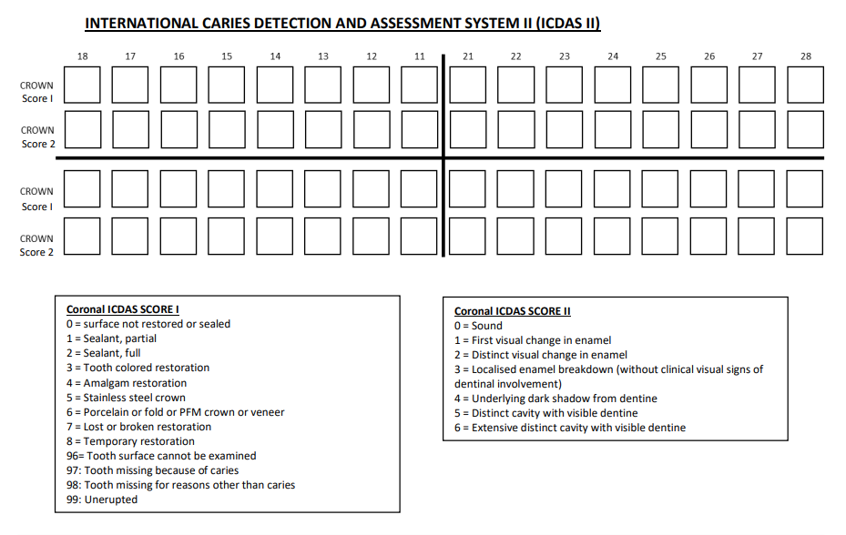
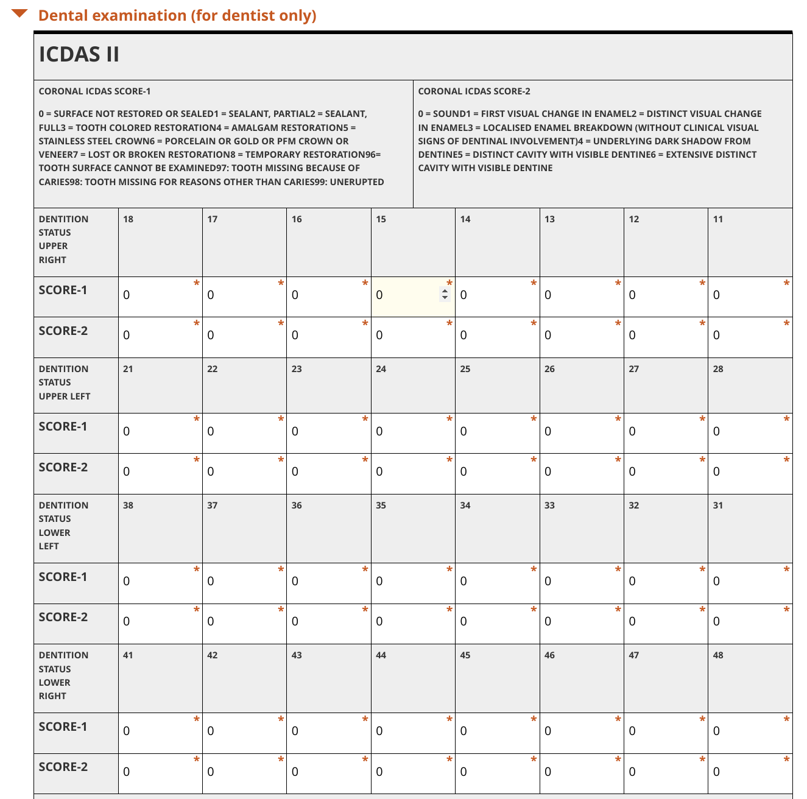

# ODK 

Open Data Toolkit [ODK](https://getodk.org/) is a powerful offline forms to collect the data you need wherever it is.

We used it in conjuction with [Kobo Toolbox](https://www.kobotoolbox.org/) to collect data about the health metrics.

We developed our templates based on the [WHO - OralHealth Surveys - Basic Methods](http://apps.who.int/iris/bitstream/handle/10665/97035/9789241548649_eng.pdf;jsessionid=9D80F63471B9C335CF359381553DF0F2?sequence=)

We mapped common templates for data collection such as   
 

You can reuse the full template for your projects or just some of the questions you might need in your survey.

## ODK Telplates

This contains the templates we used for the elite athletes survey.

- Survery deployed on Jun 7, 2022 templates [xlsx](ahP9qxiHtZoJrVaKw8Pqte.xlsx) and [xml](ahP9qxiHtZoJrVaKw8Pqte.xml)

